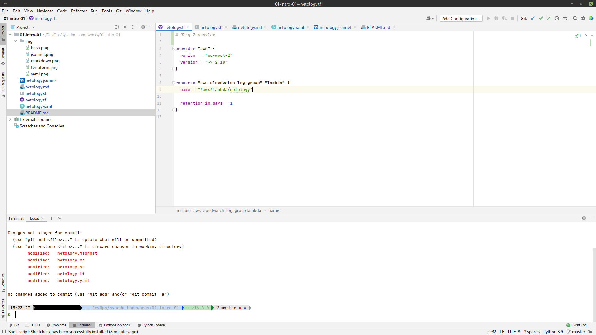
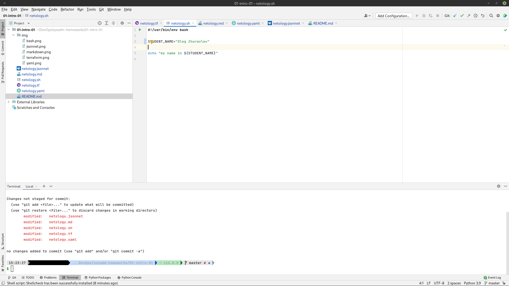
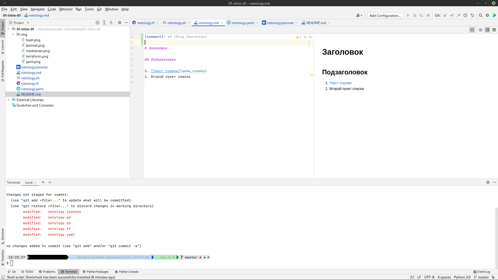
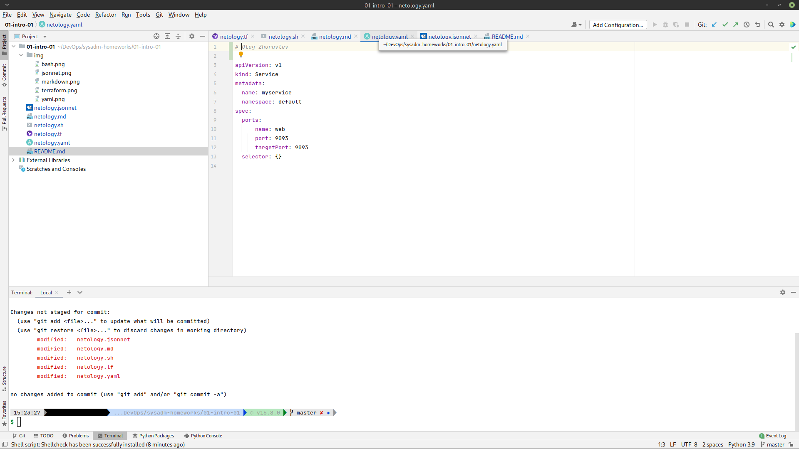
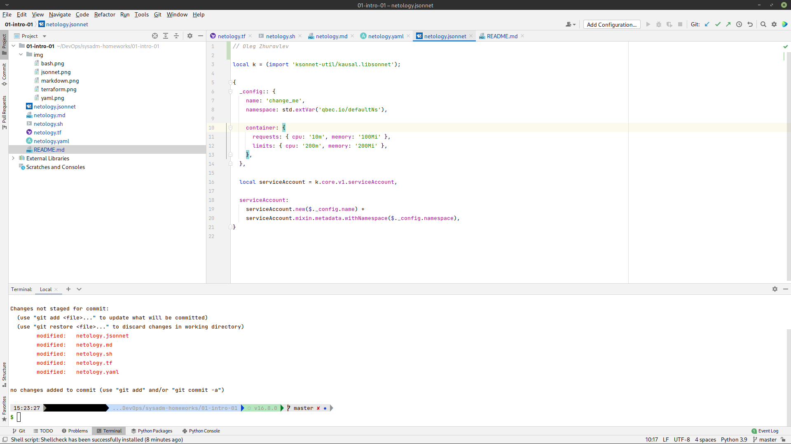

# Домашнее задание к занятию «1.1. Введение в DevOps»

## Задание №1 - Подготовка рабочей среды

1. Убедитесь, что работает подсветка синтаксиса, файлы должны выглядеть вот так:
    - Terraform:
    - Bash:
    - Markdown:
    - Yaml:
    - Jsonnet:

## Задание №2 - Описание жизненного цикла задачи (разработки нового функционала)

### Описание истории

Представьте, что вы работаете в стартапе, который запустил интернет-магазин. Ваш интернет-магазин достаточно успешно развивался, и вот пришло время налаживать процессы: у вас стало больше конечных клиентов, менеджеров и разработчиков.Сейчас от клиентов вам приходят задачи, связанные с разработкой нового функционала. Задач много, и все они требуют выкладки на тестовые среды, одобрения тестировщика, проверки менеджером перед показом клиенту. В случае необходимости, вам будет необходим откат изменений. 

### Решение задачи в соответствии с жизненным циклом разработки ПО
*Допустим, работаем по Scrum.*

| N этапа | Вовлеченные роли | Действие | Участие DevOps-инженера |
|:---:|---|---|---|
| 1 | Менеджер (Product Owner, PO) |  Получение требований и согласование ТЗ на новый функционал с заказчиком. Создание списка задач (Product BackLog) с ранжированием задач по важности для заказчика. | Предоставить PO любой удобный инструмент, позволяющий создать список задач и проставить ранги. Это м.б. что угодно, начиная от блокнота и до Kanban-систем, вроде Jira.|
| 2 | PO и разработчики (Development Team, DevT)    |  Оценка трудоёмкости задач и отбор задач на спринт (т.е. создание Spring Backlog).  | Предоставить любой удобный инструмент для выполнения действия (сервис для Scrum Poker, сервис для создания списка задач (напр.Jira), сервис для ведения документации (напр.Confluence).|
| 3 | DevT | Выполнение задач.| Предоставить любой удобный инструмент для: версионирования (GitHub, GitLab, Bitbucket, Gerrit etc.), верификации (Sonar etc.), коммуникации м/у разработчиками (в т.ч. для daily, MS Teams, Zoom etc.), отлеживания ошибок (Jira, etc.).  |
| 4 | DevT и тестировщики | Проверка задач по мере выполнения. | Предоставить изолированную среду для инспекции кода и выполнения тестирования задач. Средства автоматизации и отслеживания процесса тестирования (напр. Jenkins) и коммуникации с разработчиками. |
| 5 | PO, DevT, тестировщики, представитель заказчика | Завершение очередного этапа разработки (Спринта) с проверкой, что удалось выполнить, а что нет.| Все те же организационные инструменты - отслеживание списка задач, комментарии, внесенные по мере выполнения и пр. чтобы участники могли вспомнить и проанализировать результат. |
| 6 | PO, DevT, тестировщики | Анализ процесс взаимодействия участников и возможности его улучшения. | Те же инструменты оперативной коммуникации. |
| 7 | **GOTO LINE #1** | *Повторяем итерацию Scrum.*||
