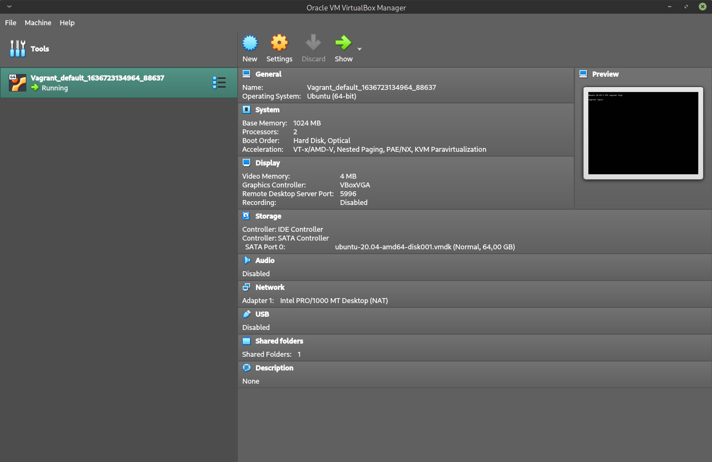
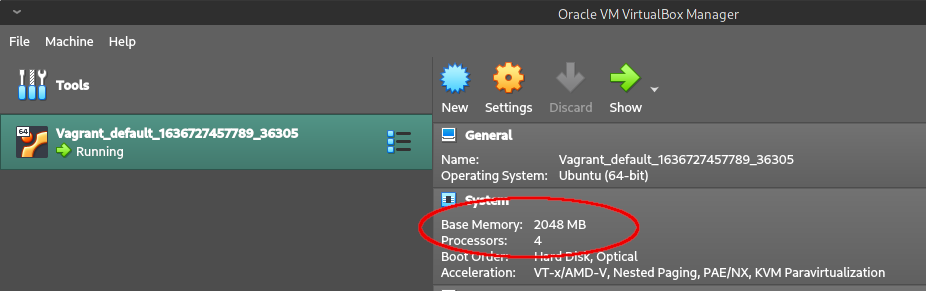
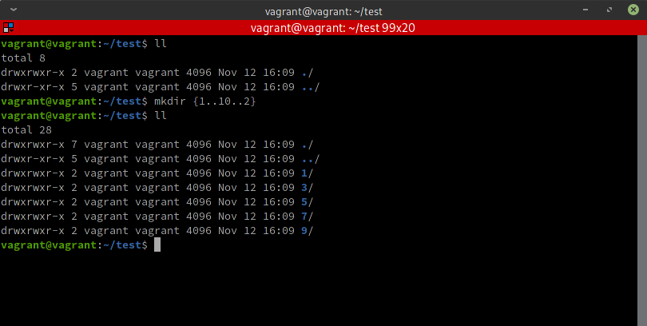
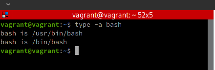
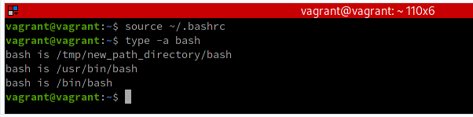
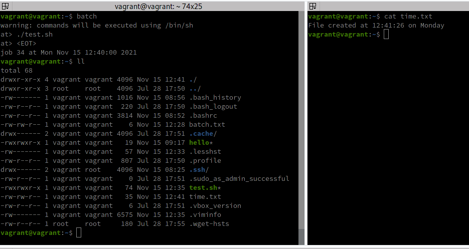

# Домашнее задание к занятию "3.1. Работа в терминале, лекция 1"

 1. Установите средство виртуализации [Oracle VirtualBox](https://www.virtualbox.org/).

---

 2. Установите средство автоматизации [Hashicorp Vagrant](https://www.vagrantup.com/).

---

 3. В вашем основном окружении подготовьте удобный для дальнейшей работы терминал. Можно предложить:

	* iTerm2 в Mac OS X
	* Windows Terminal в Windows
	* выбрать цветовую схему, размер окна, шрифтов и т.д.
	* почитать о кастомизации PS1/применить при желании.

	Несколько популярных проблем:
	* Добавьте Vagrant в правила исключения перехватывающих трафик для анализа антивирусов, таких как Kaspersky, если у вас возникают связанные с SSL/TLS ошибки,
	* MobaXterm может конфликтовать с Vagrant в Windows,
	* Vagrant плохо работает с директориями с кириллицей (может быть вашей домашней директорией), тогда можно либо изменить [VAGRANT_HOME](https://www.vagrantup.com/docs/other/environmental-variables#vagrant_home), либо создать в системе профиль пользователя с английским именем,
	* VirtualBox конфликтует с Windows Hyper-V и его необходимо [отключить](https://www.vagrantup.com/docs/installation#windows-virtualbox-and-hyper-v),
	* [WSL2](https://docs.microsoft.com/ru-ru/windows/wsl/wsl2-faq#does-wsl-2-use-hyper-v-will-it-be-available-on-windows-10-home) использует Hyper-V, поэтому с ним VirtualBox также несовместим,
	* аппаратная виртуализация (Intel VT-x, AMD-V) должна быть активна в BIOS,
	* в Linux при установке [VirtualBox](https://www.virtualbox.org/wiki/Linux_Downloads) может дополнительно потребоваться пакет `linux-headers-generic` (debian-based) / `kernel-devel` (rhel-based).

---

 4. С помощью базового файла конфигурации запустите Ubuntu 20.04 в VirtualBox посредством Vagrant:

	* Создайте директорию, в которой будут храниться конфигурационные файлы Vagrant. В ней выполните `vagrant init`. Замените содержимое Vagrantfile по умолчанию следующим:

		```bash
		Vagrant.configure("2") do |config|
			config.vm.box = "bento/ubuntu-20.04"
		end
		```

	* Выполнение в этой директории `vagrant up` установит провайдер VirtualBox для Vagrant, скачает необходимый образ и запустит виртуальную машину.

	* `vagrant suspend` выключит виртуальную машину с сохранением ее состояния (т.е., при следующем `vagrant up` будут запущены все процессы внутри, которые работали на момент вызова suspend), `vagrant halt` выключит виртуальную машину штатным образом.

---

 5. Ознакомьтесь с графическим интерфейсом VirtualBox, посмотрите как выглядит виртуальная машина, которую создал для вас Vagrant, какие аппаратные ресурсы ей выделены. Какие ресурсы выделены по-умолчанию?

Выделенные ресурсы можно увидеть на вкладке GUI Oracle VM:


Если смотреть на GUI желания почему-то нет, то можно получить те же данные из самой виртуальной машины посредством множества разнообразных команд (следует сначала подключиться к ВМ через ssh под root-правами с помощью **vagrant ssh**), например:<br/>
- используемая оперативная система: **uname -a** или **cat /etc/issue**<br/>
- выделенная и использованная память: **free -m** (ещё более подробную информацию можно увидеть через cat /proc/meminfo, например, размер свободной памяти можно спарсить с помощью **grep MemFree /proc/meminfo**)<br/>
- количество процессоров и пр.инфо о процессорах: **cat /proc/cpuinfo**<br/>
- использование виртуализации и пр.инфо о процессорах: **lscpu**<br/>
- графический контроллер и прочие PCI-устройства: **lspci -tv**<br/>
- информация о файловой системе и использованном дисковом пространстве: **df -h** и **du -sh**<br/>
- сетевые параметры: **ifconfig** (может потребоваться установка пакета **net-tools**)<br/>
- использование USB-портов (хранилищ): **fdisk -l**<br/>

Кроме упомянутых, различных команд и пакетов огромное множество и они позволяют получить любую необходимую информацию.

---

  6. Ознакомьтесь с возможностями конфигурации VirtualBox через Vagrantfile: [документация](https://www.vagrantup.com/docs/providers/virtualbox/configuration.html). Как добавить оперативной памяти или ресурсов процессора виртуальной машине?

Помимо непосредственно настроек в Oracle VM также можно указать соответствующие параметры в конфигурационном файле "Vagrantfile". Например, указать требуемый объём ОЗУ можно с помощью параметра **memory**, количество процессоров с помощью параметра **cpus**, например:

    * config.vm.provider "virtualbox" do |comp|
        comp.memory = 2048
        comp.cpus = 4
    * end

Перезапустив ВМ мы увидим, что параметры памяти и количества процессоров изменились:


---

  7. Команда `vagrant ssh` из директории, в которой содержится Vagrantfile, позволит вам оказаться внутри виртуальной машины без каких-либо дополнительных настроек. Попрактикуйтесь в выполнении обсуждаемых команд в терминале Ubuntu.

---

  8. Ознакомиться с разделами `man bash`, почитать о настройках самого bash:

    * какой переменной можно задать длину журнала `history`, и на какой строчке manual это описывается?
    * что делает директива `ignoreboth` в bash?

а) В **строке 677** указано, что длина журнала истории задается переменной **@HISTSIZE**.
Если установить значение равно 0, то команды запоминаться в истории не будут.

Если установить отрицательное значение, то длина истории программно ограничиваться не будет.

Указано, что значение по умолчанию 500 устанавливается после парсинга запускающего файла ,если в файле не указано иное.
Иное значение можно задать указав это значение для переменной, например так:<br/>
**HISTSIZE=1000**

б) В **строке 658** документации указано, что директива `ignoreboth` является сокращением двух других директив `ignorespace` и `ignoredups`. Обе они применяются к переменной **$HISTCONTROL**, представляющей собой разделенный запятыми список значений, указывающих, как команды сохраняются в истории. Если в этом списке присутствует директива `ignorespace`, значит команды, начинающиеся с пробелов в историю не сохранятся. Директива `ignoredups` (_"игнорировать дубликаты"_) позволяет исключить из истории повторяющиеся команды. Т.о. `ignoreboth`, установленная для переменной **$HISTCONTROL**, позволяет исключить из истории как команды, начинающиеся с пробела, так и повторяющися команды.

---

 9. В каких сценариях использования применимы скобки `{}` и на какой строчке `man bash` это описано?

Поиск по `{` можно осуществить, экранировав символ фигурных скобок с помощью нисходящего слэша:
```
/\{
```
На это мы получим совпадение на строке 149, откуда узнаем, что фигурная скобка является зарезервированным (т.е. специальным) символом.<br/>

 Осуществляя дальнейший поиск нажатием кнопки `N` ("next") на строке 214 находим применение фигурных скобок для создания "групповых команд", выполняемых в текущем окружении. Внутри скобок такие групповые команды отделяются символами новой строки или точкой с запятой. Сами фигурные скобки отделяются от списка команд пробелами.

  Также фигурные скобки являются ограничителями тела функции (строки 322-323 документации `bash`).

  Третьим применением фигурных скобок является генерация строк на основе имеющихся (_brace expansion_). Например, из шаблона `a{d,c,b}e` будет сгенерировано `ade ace abe`. Возможно применять и числа, например `{1..10..2}` сгенерирует значения от 1 до 10 (включительно) с шагом 2, т.е. `1,3,5,7,9`. Т.о. если вызвать что-то вроде:
````
mkdir {1..10..2}
````
то в текущей директории будут созданы директории с именами "1", "3", "5", "7" и "9":


 Четвертым случаем использования фигурных скобок в bash является перенаправление (_redirection_) потока ввода или вывода команд, когда фигурными скобками обрамляется переменная, представляющая дескриптор перенаправляемого файла.

---

 10. Основываясь на предыдущем вопросе, как создать однократным вызовом `touch` 100000 файлов? А получилось ли создать 300000? Если нет, то почему?

Описанное выше **_Brace expansion_** теоретически позволяет генерировать любое количество новых строк. В т.ч. такая команда, например, позволяет сгенерировать 100 тысяч файлов с именами  вида "file1", "file2" ... "file100000":
````
touch file{1..100000}
````

Однако создать 300 тысяч файлов уже не получится - получим ошибку "Argument list loo long" потому что существует ограничение на длину строки аргументов, передаваемых в однострочную команду и для **Ubuntu 20.04.2 LTS** он равен 2097152, что задаётся системной переменной **ARG_MAX**.
Текущее значение этой переменной можно узнать вызвав:
````
getconf ARG_MAX
````
Значение этой переменной можно изменить в исходных файлах ядра (но затем ядро придется перекомпилировать).

---

 11. В man bash поищите по `/\[\[`. Что делает конструкция `[[ -d /tmp ]]`

В квадратные скобки заключаются `условные выражения`. В зависимости от того, вернет условное выражение 0 или 1 можно выполнять те или иные действия. Например, выражение **[ -d /tmp ]** (пробелы возле скобок обязательны) вернет 1 если в корневой директории ("/") существует директория с именем "tmp".

Условные выражения широко применяются при написании скриптового кода. Пример скрипта, проверяющего переданное в аргумент имя директории и выводящего сообщение, существует такая директория или нет:
````
#! /bin/bash
file=$1
if [ -d $file ] then
    echo -e "Folder $file exists"
else
    echo -e "Folder $file doesn't exist"
fi
````
**Двойные квадратные скобки** являются зарезервированной комбинацией символов позволяющей задавать _**улучшенные**_ условные выражения, которые работают в целом так же, как и обычные условные выражения за несколькими отличиями.

В **улучшенных** условных выражениях:
 - в операторах `<` и `>` сравнение производится с использованием текущей локали. В обычных условных операторах используется ASCII-сравнение.

 - сравнение строк производится с помощью паттернов, в то время как в обычных условных выражениях используется обычное сравнение строк, являющееся более быстрым.

 - логическое выражение (например, `arg1 -gt arg2`) рассматривает аргументы как арифметические выражения, в то время как в обычных условных выражениях это положительные или отрицательные целые числа. 

Кроме того, выражение `[[ -d /tmp ]]` является _**улучшенным**_ потому что работает на большинстве современных терминалов, таких как Korn, Bash, Zsh, Ksh и д.р.

Улучшенные условные выражения не являются частью стандартов POSIX, поэтому, если требуется, чтобы скрипт гарантированно работал на POSIX-оболочках, то лучше использовать обычные квадратные скобки с учётом их особенностей.

---

 12. Основываясь на знаниях о просмотре текущих (например, PATH) и установке новых переменных; командах, которые мы рассматривали, добейтесь в выводе type -a bash в виртуальной машине наличия первым пунктом в списке:

	```bash
	bash is /tmp/new_path_directory/bash
	bash is /usr/local/bin/bash
	bash is /bin/bash
	```

	(прочие строки могут отличаться содержимым и порядком)
    В качестве ответа приведите команды, которые позволили вам добиться указанного вывода или соответствующие скриншоты.

Команда `type -a` позволяет получить путь к исполняемому файлу. При этом данный файл должен существовать по указанному пути. Путь указывается в переменной окружения PATH.
Соответственно, для создания искомого  файла просто скопируем его из некоторой известной директории (её можно получить, например, вызвав команду 'type -a bash'):



в новую директорию, которую сначала создадим:

````
mkdir /tmp/new_path_directory
cp /bin/bash /tmp/new_path_directory/bash
````

Обращаем внимание, что имя конечного файла тоже нужно задавать!

Создадим новый путь в переменной окружения PATH, добавив её в начало уже существующего значения PATH, чтобы она оказалась первой в списке (сделаем это не пользуясь редактором, т.к. нам достаточно добавить её в конец существующего файла):

````
echo 'export PATH=/tmp/new_path_directory:$PATH' >> ~/.bashrc
````

Переинициализируем окружение, чтобы новый значения переменных вступили в силу с помощью команды `source` и типерь команда `type -a bash` выводит добавленный путь и он первый в списке:



---

 13. Чем отличается планирование команд с помощью `batch` и `at`?

Обе команды предназначены для отложенного запуска одноразовых задач, но команда at позволяет выполнить такую задачу в назначенное время, а команда batch выполнит задачу при снижении уровня загруженности системы до некоторого значения.

Команды принадлежат пакету `at` и для работы требуют запущенной службы `atd`.

**Примечание**: проверить наличие инсталлированного пакета можно командой:
````
apt list --installed | grep "at" -w
````

**Примечание**: проверить запущена ли служба можно командой:
````
systemctl list-units --all --type=service --no-pager | grep atd
````

<br/>

###### **Пример использования команды at:**

Создадим, например, исполняемый файл `test.sh` со следующим содержимым:
````
#!/bin/bash
echo "File created at $(date +%T) on $(date +%A)" >> time.txt
````

Теперь можно задать его выполнение через одну минуту командой:
````
at now + 1 minutes -f test.sh
````

В начале следующей минуты в текущей директории будет создан файл с именем `time.txt` содержимым вроде:
````
File created at 12:18:00 on Monday
````

**Примечание**: при запуске команды `at` выдаётся сообщение `"warning: commands will be executed using /bin/sh"` являющееся
предупреждением, что `at` всегда выполняется в оболочке `/bin/sh`, а не в той, в которой работает пользователь в данный момент!

**Примечание**: команда `at` м.б. вызвана в многострочном режиме, выход из которого производится комбинацией клавиш `Ctrl+D`.

###### **Пример использования команды batch:**

Команда запускается только в многострочном режиме, но, в целом, аналогична команде `at`, за исключением того, что задача будет вызвана не по расписанию, а когда нагрузка на сервер спадёт до приемлемого уровня (приемлемый уровень загрузки сервера м.б. задан командой `atd`).
Целью команды является выполнение ресурсоемких команд в более подходящее для этого время.

Пример вызова того же скрипта test.sh, что использовался для демонстрации работы команды `at` приводится на скриншоте:



Как видим, файл был создан немедленно, потому что нагрузка на систему была ниже порога ожидания на выполнение.

Вывести список задач, ожидающих выполнения, можно командами: `at -l` или `atq`<br/>
Удалить задачу из списка на выполнение можно командой: `atr НомерКомандыВСписке`

---

 14. Завершите работу виртуальной машины чтобы не расходовать ресурсы компьютера и/или батарею ноутбука.
````
vagrant halt
````
 ---

## Как сдавать задания

Обязательными к выполнению являются задачи без указания звездочки. Их выполнение необходимо для получения зачета и диплома о профессиональной переподготовке.

Задачи со звездочкой (*) являются дополнительными задачами и/или задачами повышенной сложности. Они не являются обязательными к выполнению, но помогут вам глубже понять тему.

Домашнее задание выполните в файле readme.md в github репозитории. В личном кабинете отправьте на проверку ссылку на .md-файл в вашем репозитории.

Также вы можете выполнить задание в [Google Docs](https://docs.google.com/document/u/0/?tgif=d) и отправить в личном кабинете на проверку ссылку на ваш документ.
Название файла Google Docs должно содержать номер лекции и фамилию студента. Пример названия: "1.1. Введение в DevOps — Сусанна Алиева".

Если необходимо прикрепить дополнительные ссылки, просто добавьте их в свой Google Docs.

Перед тем как выслать ссылку, убедитесь, что ее содержимое не является приватным (открыто на комментирование всем, у кого есть ссылка), иначе преподаватель не сможет проверить работу. Чтобы это проверить, откройте ссылку в браузере в режиме инкогнито.

[Как предоставить доступ к файлам и папкам на Google Диске](https://support.google.com/docs/answer/2494822?hl=ru&co=GENIE.Platform%3DDesktop)

[Как запустить chrome в режиме инкогнито ](https://support.google.com/chrome/answer/95464?co=GENIE.Platform%3DDesktop&hl=ru)

[Как запустить  Safari в режиме инкогнито ](https://support.apple.com/ru-ru/guide/safari/ibrw1069/mac)

Любые вопросы по решению задач задавайте в чате Slack.

---
