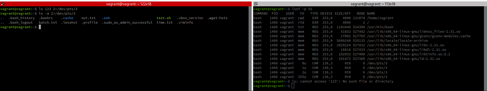

# Домашнее задание к занятию "3.2. Работа в терминале, лекция 2"

1. Какого типа команда `cd`? Попробуйте объяснить, почему она именно такого типа; опишите ход своих мыслей, если считаете что она могла бы быть другого типа.

````
$ type -a cd  
cd is a shell builtin
````

`shell builtin` ("встроенная в оболочку") значит, что команда является частью самой оболочки, и при её вызове исполнятся код, встроенный в саму оболочку, а не какой-то другой исполняемый код.

Команда изменения рабочей директории встроена в оболочку по причине того факта, что каждая исполняемая программа запускается в отдельном процессе и у каждого рабочего процесса существует своя рабочая директория. Поэтому вызов `cd` как внешней программы не смог бы переключать рабочую директорию оболочки, которая эту программу загрузила.

Отсюда можно сделать два вывода:
 - по ряду причин, запускающая оболочка, являясь родительским процессом для запускаемой программы, не передает этой программе легальных возможностей (ссылку на себя, полномочия, API и т.д.) для управления собой;
 - если команда является `shell builtin`, то её невозможно перегрузить псевдонимом или другим исполняемым файлом - в целях сохранения функциональности оболочка всё равно должна использовать встроенный вариант.

---
2. Какая альтернатива без pipe команде `grep <some_string> <some_file> | wc -l`? `man grep` поможет в ответе на этот вопрос. Ознакомьтесь с [документом](http://www.smallo.ruhr.de/award.html) о других подобных некорректных вариантах использования pipe.

Команда `grep <some_string> <some_file>` выводит строки файла(ов), соответствующие указанному шаблону.
Команда `wc` выводит статистику по каждому из указанных файлов - количество строк, слов и длину в байтах. Флаг `-l` указывает выводить только количество строк.
Соответственно, чтобы добиться того же самого результата только с помощью команды `grep`, можно вызвать её с флагами `-c` и `-h`, первый из которых выводит количество найденных строк, а второй подавляет вывод имен файлов.

Допустим, у нас имеется 3 файла, `1.txt`, `2.txt` и `3.txt` с одинаковым содержимым `Hello World!`

Вызов этих двух вариантов команд применительно к одному файлу приводит к одинаковым результатам:


Однако, существует различие - если одной командой `grep` обрабатывается сразу несколько файлов, то `grep -ch` будет выводить статистику для каждого файла в отдельности:


в то время как `grep hello 1.txt 2.txt 3.txt -i | wc -l` выведет их совокупное значение, поскольку `wc` здесь будет применён сразу ко всему результату, возвращённому `grep`:


---
3. Какой процесс с PID `1` является родителем для всех процессов в вашей виртуальной машине Ubuntu 20.04?

Получить имя процесса по его PID можно множеством способов, например:
````
$ ps --pid 1
PID TTY          TIME CMD
1 ?        00:00:02 systemd
````
Таким образом, имя процесса с PID=1 это `systemd`, являющийся демоном инициализации других демонов. В процессе загрузки системы он получает настройки из папки `/etc/systemd/system` и для каждой запускает соответствующий процесс.

---
4. Как будет выглядеть команда, которая перенаправит вывод stderr `ls` на другую сессию терминала?

Чтобы перенаправить вывод потока ошибок на другую сессию терминала нам необходимо узнать, с каким файловым представлением он ассоциирован. Это можно выяснить с помощью команды `lsof -p $$` (результат приведен в правом окне скриншота ниже).

Альтернативным способом является поиск такой ассоциации по PID процесса. Узнать PID терминала можно выполнив в нём команду `echo $$`, а затем выполнив команду `ls -l /proc/НайденныйPID/fd`.


Выяснив, что в нашем случае это `/dev/pts/3` можно вызвать команду `ls` с перенаправлением потока ошибок `stderr` в этот терминал (левое окно скриншота ниже, команда `ls 123 2>/dev/pts/3` намеренно содержит ошибку). При этом стандартный поток `stdout` по-прежнему выводится в текущий терминал (левое окно скриншота ниже, команда `ls -a 2>/dev/pts/3`).



---
5. Получится ли одновременно передать команде файл на stdin и вывести ее stdout в другой файл? Приведите работающий пример.

Пусть команда `cat` прочитает данные из файла `in.txt` и отправит результат `stdout` в файл `out.txt`, а `stderr` в файл `err.txt`.
Для этого вызовем её два раза, первый раз передав ей в `stdin` существующий файл `in.txt`, содержащий строку `"Hello World!"`,
а второй раз - передав ей в `stdin` имя директории `.ssh`, что вызывает ошибку:


Видим, что после корректного вызова в файле `out.txt` оказалось содержимое входного файла, а файл `err.txt` пуст, а после вызова с ошибкой, наоборот, файл `out.txt` пуст, а файл `err.txt` стал содержать текст ошибки.

Также можно перенаправить и `stdout` и `stderr` в один файл `out.txt`:


---
6. Получится ли вывести, находясь в графическом режиме, данные из PTY в какой-либо из эмуляторов TTY? Сможете ли вы наблюдать выводимые данные?

Например, отправим строки "Hello1", "Hello2" и "Hello3", соответственно в первый, второй и третий терминалы:


Переключаясь в каждый из терминалов комбинациями клавиш Ctrl+Alt+F1, Ctrl+Alt+F2 и Ctrl+Alt+F3 соответственно, мы увидим в каждом из них соответствующую строку:


---
7. Выполните команду `bash 5>&1`. К чему она приведет? Что будет, если вы выполните `echo netology > /proc/$$/fd/5`? Почему так происходит?

Оператор `>&` указывает перенаправить один файловый дескриптор создаваемого процесса (здесь это команда `bash`) на другой (здесь `1` - т.е. `stdin`).
Поэтому команда `bash 5>&1` выполнит следующее:
- в файловых представлениях структур ядра будет создан новый файловый дескриптор с номером 5 - `/proc/Pid_Процесса/fd/5` (из этого же потока он также доступен как `/proc/self/fd/5` или `/proc/$$/fd/5`);
- созданный файловый дескриптор будет назначен процессу `bash` (в дополнение к файловым дескрипторам `1`, `2` и `3`, унаследованным от родительского процесса);
- этот файловый дескриптор будет направлен на унаследованный от родителя дескриптор `1` (`stdout`);
- запущен новым процесс экземпляра консоли **bash** в качестве дочернего от текущего процесса консоли.

Теперь, например, можно вывести сообщение в эту консоль путем вызова команды `echo` с указанным файловым дескриптором:


Кроме того, как видно из скриншота, сообщение можно отправить и из другого потока, воспользовавшись известным PID, заменив в команде `/proc/$$/fd/5` выражение `$$` на этот PID (здесь он равен 1979). 

---
8. Получится ли в качестве входного потока для pipe использовать только stderr команды, не потеряв при этом отображение stdout на pty? Напоминаем: по умолчанию через pipe передается только stdout команды слева от `|` на stdin команды справа.
Это можно сделать, поменяв стандартные потоки местами через промежуточный новый дескриптор, который вы научились создавать в предыдущем вопросе.

Для достижения поставленной задачи воспользуемся тем эффектом, что левая часть оператора `>` объявляет новый дескриптор.
Команда будет иметь вид:

`команда 3>&2 2>&1 1>&3 | grep ИскомаяСтрока`, где:

**Шаг 1**: `3>&2` - объявляем новый дескриптор `3` текущего процесса с перенаправлением его на унаследованный от родительского процесса `stderr` (этот новый дескриптор пригодиться позже);

**Шаг 2**: `2>&1` - объявляем новый дескриптор `2` (`stderr`) текущего процесса с перенаправлением его на унаследованный от родительского процесса `stdout` чтобы `"pipe"` смог им воспользоваться и получить поток ошибок;

**Шаг 3**: `1>&3` - объявляем новый дескриптор `1` (`stdout`) текущего процесса и перенаправляем его на созданный в шаге 1 дескриптор 3, чтобы команда в случае нормального выполнения могла вывести результат своего выполнения через свой `stdout`. 

**Таким образом:**
 - выполнение команды без ошибок вызывает следующую цепочку:<br/>
**[stdout команды]** -> **[поток id=3 команды]** -> **[stderr родительского процесса]**. И т.к. `"pipe"` реагирует только на `stdout`, то тут он не сработает, т.к. цепочка оканчивается на `stderr`;
 - выполнение команды с ошибкой вызывает цепочку:<br/>
**[stderr команды]** -> **[stdout родительского процесса]** и тогда `"pipe"` передаст результат в `grep`, цепочка заканчивается на `stdout`.
 
Для проверки вызовем команду `ll`, что должно вывести список файлов текущей директории:<br/>
`ll 3>&2 2>&1 1>&3 | grep "No such file"`.


А затем вызовем ту же команду `ll`, но на этот раз указал в качестве параметра несуществующий файл `ZZZZ`:<br/>
`ll ZZZZZ 3>&2 2>&1 1>&3 | grep "No such file"`.

Результаты выполнения приведены на скриншоте:


Как видим, оператор `grep` срабатывал только для случая ошибки, в то время как нормальная работа оператора `ll` им не обрабатывалась. 

---
9. Что выведет команда `cat /proc/$$/environ`? Как еще можно получить аналогичный по содержанию вывод?


Папка '/proc' содержит файловое представление процессов в разрезе их идентификаторов и, соответственно, `/proc/$$` содержит данные процесса, в т.ч. **исходные** значения переменных окружения.

Вызов `cat /proc/$$/environ` полностью аналогичен вызову `cat /proc/PidПроцесса/environ` и частично аналогичен вызову
`cat /proc/self/environ`.

Также для получения данных о переменных окружения можно воспользоваться командой `env`, которая будучи вызванной без параметров выводит расширенный набор переменных окружения.

Аналогично можно использовать и другие программы, например `xargs --null --max-args=1 echo < /proc/$$/environ`:


---
10. Используя `man`, опишите что доступно по адресам `/proc/<PID>/cmdline`, `/proc/<PID>/exe`.

С помощью команды `man -Ka --regex "/proc/.+/cmdline"`, использующей регулярное выражение, можно выполнить поиск строки `/proc/<PID>/cmdline` по всей встроенной документации. Аналогично выполним и поиск `man -Ka --regex "/proc/.+/exe"`.

Искомое описание обнаруживается в документации к командам `proc` и `procfs`:  

- **/proc/[pid]/cmdline** - этот файл содержит полную командную строку процесса до момента перехода процесса в зомби-состояние - тогда файл будет пуст и содержать 0 символов. Аргументы командной строки отображаются в этом файле в виде набора строк, разделенных нулевым байтом ('\0') и с нулевым байтом после последней строки.

-  **/proc/[pid]/exe** - начиная с Linux 2.2 и позже этот файл является симлинком, содержащим действительный путь к исполненной команде. Этот симлинк разыменовывается нормальным образом - попытка его открыть приведет к открытию исполняемого файла. Можно даже вызвать /proc/[pid]/exe для запуска еще одной копии того же исполняемого файла, что был запущен просессом с этим PID. Если путь был изменен, то симлинк будет содержать строку `(deleted)` добавленную к исходному пути. В многопоточном процессе содержимое такого симлинка является недоступным если главный процесс был прерван.

---
11. Узнайте, какую наиболее старшую версию набора инструкций SSE поддерживает ваш процессор с помощью `/proc/cpuinfo`.


Как следует из скриншота, по результатам выполнения команды `cat /proc/cpuinfo | grep sse` наиболее старшей версией для данного CPU является **SSE 4.2** (`sse4_2`).

---
12. При открытии нового окна терминала и `vagrant ssh` создается новая сессия и выделяется pty. Это можно подтвердить командой `tty`, которая упоминалась в лекции 3.2. Однако:

     ```bash
     vagrant@netology1:~$ ssh localhost 'tty'
     not a tty
     ```

     Почитайте, почему так происходит, и как изменить поведение.


Команда `ssh` запускает удаленный терминал OpenSSH (Open Secure Shell).
Команда `tty` выводит файловое имя терминала, подключенного к стандартному вводу.

По умолчанию, если происходит выполнение команды на удалённой машине через SSH, то TTY не создаётся, чтобы не нагружать систему без необходимости и не создавать дополнительных сложностей с настройкой TTY при пересылке, например, бинарных данных. Такое поведение реализовано потому, что при удалённом выполнении команды TTY может просто не пригодиться. 

Но если попробовать подключиться к удалённой машине через SSH **БЕЗ указания команды**, TTY уже будет создан, потому что подразумевается, что подключившись, пользователь будет использовать этот терминал и выполнять команды на удалённой машине через него.

Однако есть возможность принудительного создания псевдотерминала TTY даже при удалённом вызове команд. Для этого следует вызывать `ssh` с ключом `-t`.

Для иллюстрации на следующем скриншоте последовательно приведены примеры вызова команд:
- локально `tty`, чтобы показать что псевдотерминал инициализирован при наличии PTY;
- `tty` как команда через `ssh`, чтобы показать, что при удалённом исполнении команды TTY не поднят;
- подключение через `ssh` в консольном режиме, чтобы показать что псевдотерминал инициализируется при вызове `ssh` без команды;
- `tty` как команда через `ssh -t`, чтобы показать, что при желании TTY всё же можно инициализировать.


Такая возможность может оказаться полезной для выполнения на удалённой машине команд, требующих экрана, например, сервисов меню и пр. 

---
13. Бывает, что есть необходимость переместить запущенный процесс из одной сессии в другую. Попробуйте сделать это, воспользовавшись `reptyr`. Например, так можно перенести в `screen` процесс, который вы запустили по ошибке в обычной SSH-сессии.

Продемонстрировать это можно следующими действиями:

- запускаем процесс, например `top`;
- переводим его в фоновый режим с помощью нажатия `Ctrl+Z`;
- запускаем этот процесс в фоновом режиме командой `bg`;
- увидеть процесс, работающий в фоновом режиме можно, например, командой `jobs -l`;
- прекратить владение процессом командой `disown -h top`;
- выяснить PID процесса через `ps -aux | grep top` (или можно взять из предыдущей `jobs -l`);
- переподключиться к процессу `reptyr <PID>`;
- на экране вновь появится работающий вывод `top`.


**Внимание!** reptyr использует системный вызов prtace(2) для подключения к удалённой программе. На некоторых ОС эта возможность по соображениям безопасности отключена. Для её активации следует в файле `/etc/sysctl.d/10-ptrace.conf` установить значение ключа `kernel.yama.ptrace_scope = 0`.

---
14. `sudo echo string > /root/new_file` не даст выполнить перенаправление под обычным пользователем, так как перенаправлением занимается процесс shell'а, который запущен без `sudo` под вашим пользователем. Для решения данной проблемы можно использовать конструкцию `echo string | sudo tee /root/new_file`. Узнайте что делает команда `tee` и почему в отличие от `sudo echo` команда с `sudo tee` будет работать.

Команда `tee` в целом аналогична командам перенаправления потока `>` и `>>` за тем исключением, что может:<br/>
а) направлять поток в несколько файлов сразу и в `stdout`;<br/>
б) может получить привилегии независимо от привилегий, назначенных предшествующей команде (здесь предшествующая команда - `echo`).

Соответственно, вызвав `echo string | sudo tee /root/new_file` мы выполняем `echo` под пользовательскими правами, `"pipe"` также выполняется под пользовательскими правами, а вот вывод в файл выполняется командой `tee` уже под суперпользователем, в папке которого и находится целевой файл.

Таким образом вывод в файл производится успешно.