# Домашнее задание к занятию "3.3. Операционные системы, лекция 1"

---
1. Какой системный вызов делает команда `cd`? В прошлом ДЗ мы выяснили, что `cd` не является самостоятельной  программой, это `shell builtin`, поэтому запустить `strace` непосредственно на `cd` не получится. Тем не менее, вы можете запустить `strace` на `/bin/bash -c 'cd /tmp'`. В этом случае вы увидите полный список системных вызовов, которые делает сам `bash` при старте. Вам нужно найти тот единственный, который относится именно к `cd`.

Перенаправив поток `stderr` на `stdout` мы сможем отфильтровать результат в поисках строки "/tmp". Очевидно, что искомый системный вызов - это `chdir`:

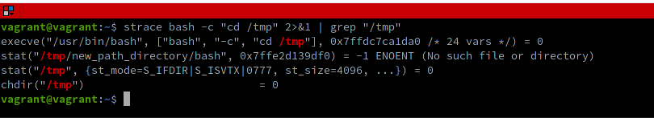


---
2. Попробуйте использовать команду `file` на объекты разных типов на файловой системе. Например:
    ```bash
    vagrant@netology1:~$ file /dev/tty
    /dev/tty: character special (5/0)
    vagrant@netology1:~$ file /dev/sda
    /dev/sda: block special (8/0)
    vagrant@netology1:~$ file /bin/bash
    /bin/bash: ELF 64-bit LSB shared object, x86-64
    ```
    Используя `strace` выясните, где находится база данных `file` на основании которой она делает свои догадки.

Для открытия доступа к любому файлу используется системный вызов `openat`. Натравим `strace` на выполнени команды `file` и отфильтруем результат по `openat`:

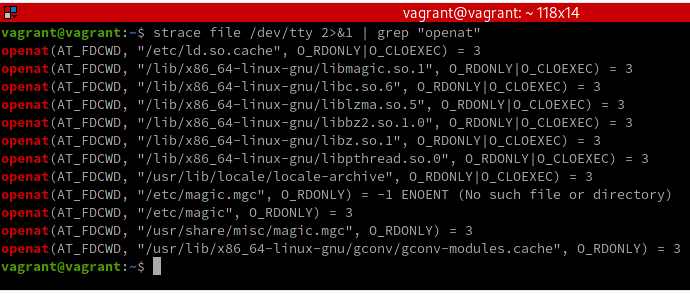

Исключим из результата кэши и библиотеки о становится очевидным, что БД для тестирования файла на тип находится по одному из путей к файлам **magic**:

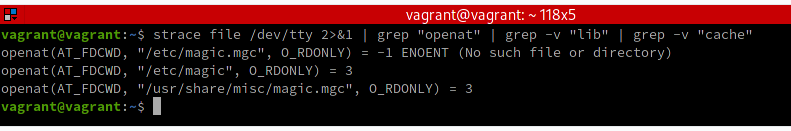

---
3. Предположим, приложение пишет лог в текстовый файл. Этот файл оказался удален (deleted в lsof), однако возможности сигналом сказать приложению переоткрыть файлы или просто перезапустить приложение – нет. Так как приложение продолжает писать в удаленный файл, место на диске постепенно заканчивается. Основываясь на знаниях о перенаправлении потоков предложите способ обнуления открытого удаленного файла (чтобы освободить место на файловой системе).

Путь наш файл лога называется `log.txt`. Тогда самый простой способ очистить содержимое открытого удалённого файла - это направить в него пустое значение любым из следующих способов:

- `> log.txt`

- `true > log.txt` или  `: > log.txt`

- `echo -n "" > log.txt`

- `truncate -s 0 log.txt`

И т.д.

Проиллюстрируем примером.
Создадим файл `cycle.sh`, эмулирующий запись текстовых строк лога в файл `log.txt` и запустим его:

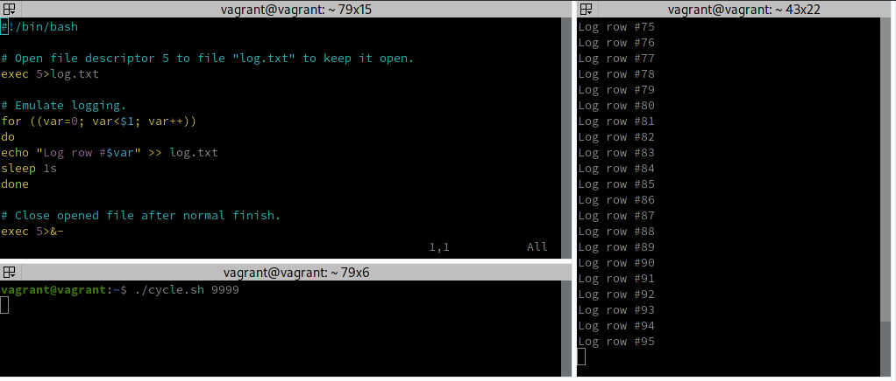


По мере работы программы размер файл увеличивается. Например, здесь он достиг 386 байт:

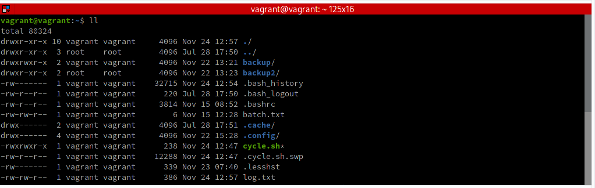


Выяснив PID запущенного процесса `cycle.sh` получим список файлов открытых этим процессом (здесь PID=3219). В составе открытых файлов наблюдаем наш лог-файл `/home/vagrant/log.txt`:

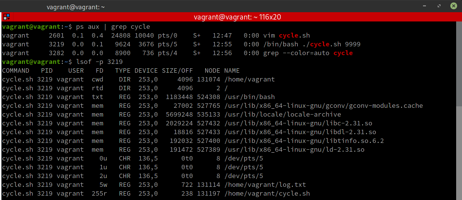


Удалим файл `log.txt` командой `rm` и вновь выведем список файлов, открытых процессом `cycle.sh`. Файл `/home/vagrant/log.txt` по-прежнему наблюдается, но здесь он уже помечен как `(deleted)`:

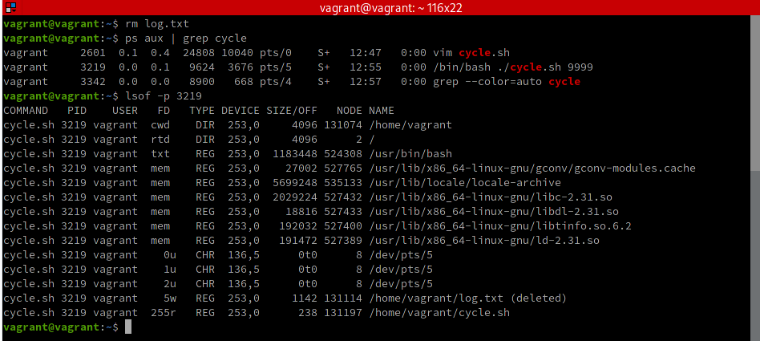


Несмотря на это, программа продолжает работать и размер лог-файла увеличиваться. К настоящему моменту он уже достиг 12593 байт. Командой `> log.txt` очистим открытый файл (программа `tail`, с помощью которой мы следили за файлом, сразу же вывела сообщение `file truncated`) и можем видеть, что размер сократился до 42 байт (что-то успело записаться в него пока мы вводили команды).

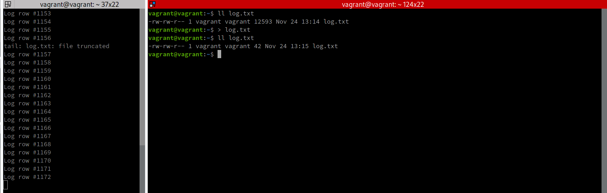

Таким образом, не прерывая работу логирующей команды мы сократили размер лог-файла. 

---
4. Занимают ли зомби-процессы какие-то ресурсы в ОС (CPU, RAM, IO)?

**Зомби-процесс** - это процесс, который завершил свою работу, но всё еще присутствует в списке процессов потому что родительский процесс еще **не прочитал его код завершения**.

Такой процесс никаких **ресурсов не занимает** и короткоживующие зомби-процессы являются нормальной ситуацией, не представляя собой проблемы. Но долгоживующие зомби-процессы **могут заполнять собой таблицу процессов**, размер которой ограничен, что может привести к невозможности родительских процессов создавать новые дочерние процессы и отказу системы.

Появление долгоживующих зомби-процессов является, как правило, следствием ошибок программирования при некорректной обработке контроля завершения дочерних процессов.

---
5. В iovisor BCC есть утилита `opensnoop`:
    ```bash
    root@vagrant:~# dpkg -L bpfcc-tools | grep sbin/opensnoop
    /usr/sbin/opensnoop-bpfcc
    ```
    На какие файлы вы увидели вызовы группы `open` за первую секунду работы утилиты? Воспользуйтесь пакетом `bpfcc-tools` для Ubuntu 20.04. Дополнительные [сведения по установке](https://github.com/iovisor/bcc/blob/master/INSTALL.md).

Получить сведения о попытках открытия файлов в течение некоторого времени можно воспользовавшись параметром `-d`:

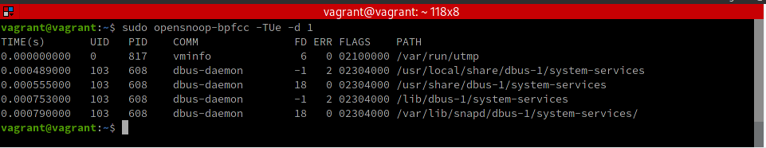

---
6. Какой системный вызов использует `uname -a`? Приведите цитату из man по этому системному вызову, где описывается альтернативное местоположение в `/proc`, где можно узнать версию ядра и релиз ОС.

После краткого анализа с помощью вызова `strace` выясняется, что используется системный вызов `uname`:

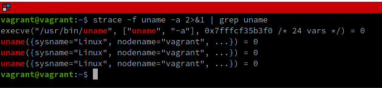

Т.к. речь идет о системном вызове, то информацию по нему следует искать в стандартном разделе №2 "Системные вызовы ядра (функции языка Си)", т.е. **uname(2)**:

`man 2 uname`

и, соответственно, находим:

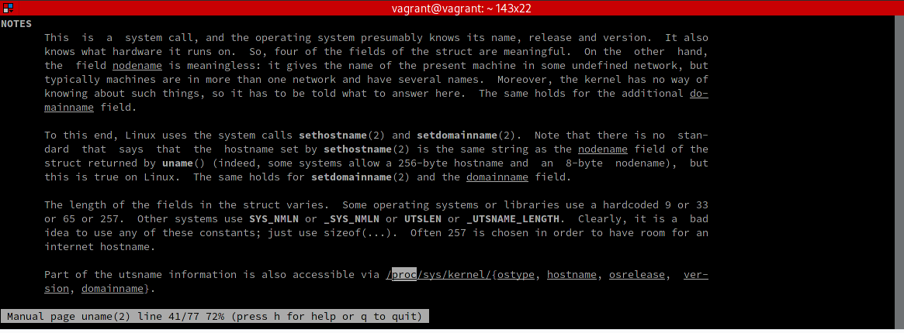

Что в переводе с эльфийского буквально означает:


> _**Часть информации utsname таже доступна через /proc/sys/kernel/{ostype, hostname, osrelease,  version, domainname}.**_


---
7. Чем отличается последовательность команд через `;` и через `&&` в bash? Например:
    ```bash
    root@netology1:~# test -d /tmp/some_dir; echo Hi
    Hi
    root@netology1:~# test -d /tmp/some_dir && echo Hi
    root@netology1:~#
    ```
    Есть ли смысл использовать в bash `&&`, если применить `set -e`?

`;` - это простой разделитель для команд, выполняемых одна за другой, а `&&` - это логическое **"И"**, т.е. команда будет выполнена только в случае успешного выполнения предыдущей команды. Соответственно, т.к. в приведенном примере директория `/tmp/some_dir` очевидно отсутствует, то первая команда вывела сообщение безотносительно результата предыдущей команды `test`. Вторая же команда вывела бы сообщение только при наличии проверяемой директории.  

При установке параметра `set -e` если выполненная команда возвращает какой-либо статус больше 0, то оболочка немедленно прекращает свою работу с выбросом исключения. Поэтому, если нужно выполнить какое-то действие не прерывая работу оболочки, то лучше использовать логические конструкции.

---
8. Из каких опций состоит режим bash `set -euxo pipefail` и почему его хорошо было бы использовать в сценариях?

`−e`  оболочка прерывает работу в случае неуспеха любой из команд;<br/>
`−u`  если есть незаданные параметры, то в stderr записывается сообщение и команда отменяется;<br/>
`−x`  оболочка записывает в stderr исполняемую команду вместе с её параметрами (до исполнения самой команды);<br/>
`−o  pipefail` если установлено, то возвращаемым значением конвейера команд является значение последней (самой правой) команды вернувшей ненулевой статус или ноль, если все команды были выполнены успешно.   


Такой режим позволяет видеть параметры исполняемых команд, что полезно для отладки, а также позволяет прервать работу скрипта, если что-то пошло не так (**транзакционный подход**). Например, в случае создания резервной копии, если не удалось произвести копирование в архив, то и старую копию удалять тоже не следует во избежание потери данных).  

---
9. Используя `-o stat` для `ps`, определите, какой наиболее часто встречающийся статус у процессов в системе. В `man ps` ознакомьтесь (`/PROCESS STATE CODES`) что значат дополнительные к основной заглавной буквы статуса процессов. Его можно не учитывать при расчете (считать S, Ss или Ssl равнозначными).

Команда `ps -eo stat --no-headers | sort | uniq -c | sort -gr` выводит искомый результат:

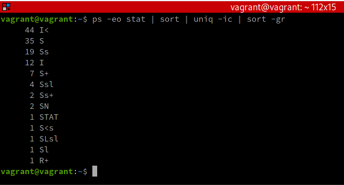

Ключи команды `ps`:
`-e` - выводить все процессы;
`-o` - указывает, какую колонку выводить (здесь - колонку статуса процесса);
`--no-headers` - строку заголовка колонок не выводить.

Внимание! Далее `sort` перед `uniq` необходим для корректной работы `uniq`, потому что `uniq` обрабатывает только смежные совпадающие строки!

Ключи команды `uniq`:
`-c` - count, выводить количество, сколько раз встречается строка.

Ключи команды `sort`:
`-g` - при сортировке сравнивать числовые значения;
`-r` - reverse, обратный порядок сортировки. Для удобства, чтобы наиболее часто встречающийся процесс был первым в списке.

Т.о., наиболее часто в данной системе встречается процесс со статусом `I<`, что соответствует бездействующим потокам ядра с высоким приоритетом.
