# Домашнее задание к занятию "3.4. Операционные системы, лекция 2"

---
1. На лекции мы познакомились с [node_exporter](https://github.com/prometheus/node_exporter/releases). В демонстрации его исполняемый файл запускался в background. Этого достаточно для демо, но не для настоящей production-системы, где процессы должны находиться под внешним управлением. Используя знания из лекции по systemd, создайте самостоятельно простой [unit-файл](https://www.freedesktop.org/software/systemd/man/systemd.service.html) для node_exporter:

    * поместите его в автозагрузку,
    * предусмотрите возможность добавления опций к запускаемому процессу через внешний файл (посмотрите, например, на `systemctl cat cron`),
    * удостоверьтесь, что с помощью systemctl процесс корректно стартует, завершается, а после перезагрузки автоматически поднимается.
    
<br/>
Загрузим приложение **"Node Exporter"**, настроим, запустим и проверим его работоспособность.

Перейдя в папку с установкой запустим "Node Exporter": `./node_exporter`

Выполнив `curl http://localhost:9100/metrics` убедимся, что Node Exporter возвращает набор метрик:

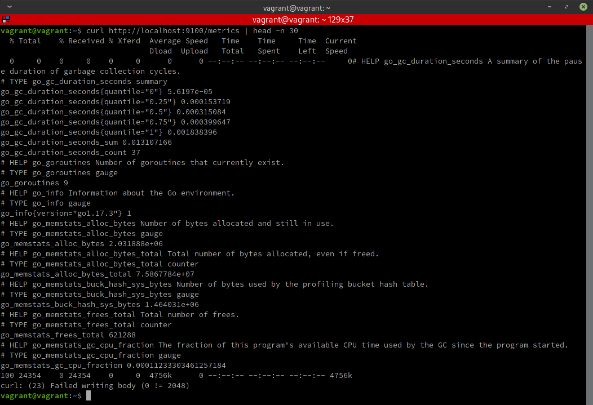

Сконфигурируем Prometheus через файл prometheus.yml, находящийся в папке установки:
````
# my global config
global:
  scrape_interval: 10s # Set the scrape interval to every 15 seconds. Default is every 1 minute.
  evaluation_interval: 10s # Evaluate rules every 15 seconds. The default is every 1 minute.
  # scrape_timeout is set to the global default (10s).

# Alertmanager configuration
alerting:
  alertmanagers:
    - static_configs:
        - targets:
          # - alertmanager:9093

# Load rules once and periodically evaluate them according to the global 'evaluation_interval'.
rule_files:
  # - "first_rules.yml"
  # - "second_rules.yml"

# A scrape configuration containing exactly one endpoint to scrape:
# Here it's Prometheus itself.
scrape_configs:
  # The job name is added as a label `job=<job_name>` to any timeseries scraped from this config.
  # `targets` defines where where exporters are running.

  # Scraper (collector of metrics) for "Prometheus" itself.
  # Default port exported by "Prometheus" is 9090.
  - job_name: 'my_prometheus'
    scrape_interval: 5s
    static_configs:
      - targets: ['localhost:9090']

  # Scraper for "Node Exporter".
  # Default port exported by "Node Explorer" is 9100.        
  - job_name: 'my_node_exporter'
    scrape_interval: 5s
    static_configs:
      - targets: ['localhost:9100']
````

Если есть желания наблюдать метрики в табличном или графическом виде в веб-интерефейсе, то загрузим приложение **"Prometheus"**.

Далее, находясь в папке с установкой запустим "Prometheus" с указанием конфигурационного файла `./prometheus --config.file=./prometheus.yml`:

Выполнив `curl localhost:9090/metrics` убедимся, что метрики от Prometheus доступны:

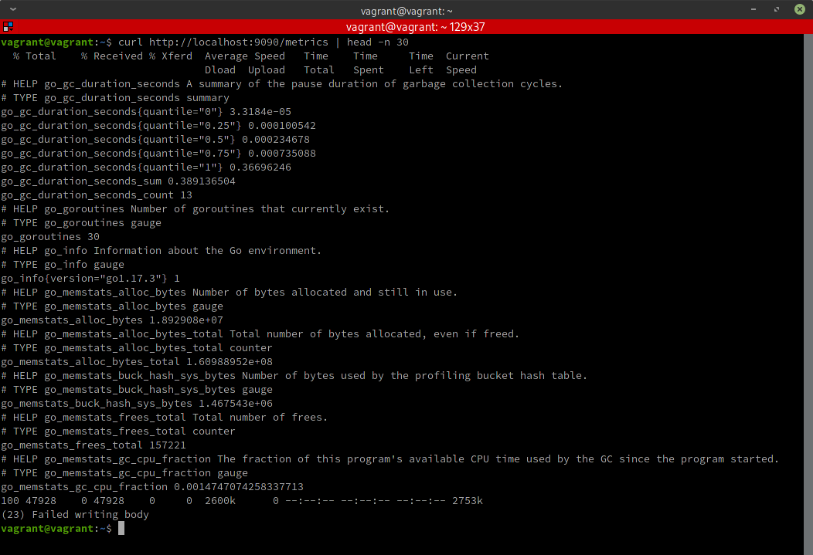

Веб-интерфейс также доступен (с примером метрики частот CPU):

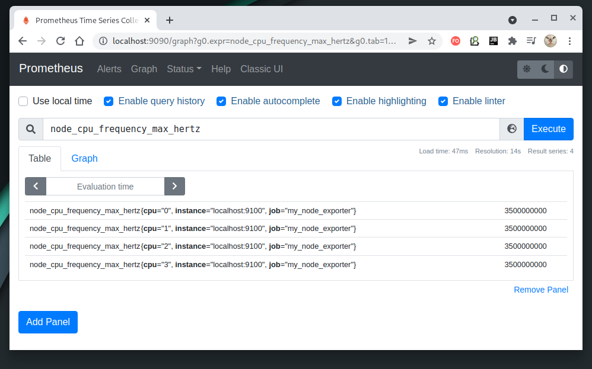


Теперь произведем перевод этих программ в категорию служб ("демонизация"). Для этого переключимся в папку `/etc/systemd/system` и в режиме суперпользователя создадим юнит-файлы служб.

Для демонизации "Node Exporter" в папке `/etc/systemd/system` создадим юнит-файл `node-exporter.service`:
````
[Unit]
Description=My Node Exporter service
After=network.service

[Service]
EnvironmentFile=-/home/vagrant/node_exporter-1.3.0.linux-amd64/node_exporter.properties
ExecStart=/home/vagrant/node_exporter-1.3.0.linux-amd64/node_exporter $EXTRA_OPTS

[Install]
WantedBy=multi-user.target
````

Дополнительные параметры предоставим из файла `node_exporter.properties` (имя файла м.б. любым) с объявленной внутри его переменной EXTRA_OPTS (имя переменной также м.б. любым):

Файл `node_exporter.properties`, с отключенными коллекторами статистики (мы включим их позже): 
````
EXTRA_OPTS=--collector.disable-defaults
````

Для демонизации "Prometheus" в папке `/etc/systemd/system` создадим юнит-файл `prometheus.service`:

````
[Unit]
Description=My Prometheus service
After=node-exporter.service
Requires=node-exporter.service

[Service]
WorkingDirectory=/home/vagrant/prometheus-2.31.1.linux-amd64
EnvironmentFile=/home/vagrant/prometheus-2.31.1.linux-amd64/prometheus.properties
ExecStart=/home/vagrant/prometheus-2.31.1.linux-amd64/prometheus $EXTRA_OPTS

[Install]
WantedBy=multi-user.target
````

Для "Prometheus", аналогично как и для "Node Exporter", дополнительные параметры предоставляются из отдельного файла `prometheus.properties` с объявленной внутри его переменной EXTRA_OPTS, содержащей имя конфигурационного файла:
````
EXTRA_OPTS=--config.file=prometheus.yml
````


В юнит-файлах в секциях **[Unit]** мы использовали следующие параметры:<br/>
**Description** - необязательный параметр, задающий описание сервиса для пользователя;<br/>
**After** - указывает, после какого сервиса должен запускаться конфигурируемый сервис. Т.к. для работы наших программ в любом случае необходима сеть, укажем в качестве такой службы `network.service`. Т.к. предполагается что служба `Prometheus` будет работать в связке со службой `Node Exporter`, то укажем таковую в юнит-файле для `Prometheus`;<br/>
**Requires** - указывает обязательные службы для запуска конфигурируемой службы. Решим, что зависимость `Prometheus` от `Node Exporter` будет обязательной.

В секциях **[Service]** указываются следующие параметры:<br/>
**ExecStart** - команда запуска сервиса;<br/>
**WorkingDirectory** - рабочая папка сервиса (для упрощения указания конфигурационных файлов, если они нужны). Обращаем внимание, что если путь содержит префикс `-`, то это признак того, что в случае отсутствия такового файла ошибку выдавать не нужно.
**EnvironmentFile** - файл окружения, содержащий дополнительную информацию (например, опции запуска).

В секциях **[Install]** указываются параметры:<br/>
**WantedBy=multi-user.target** - уровень запуска сервиса. Означает, на каком этапе загрузки системы сервис д.б. запущен. `multi-user.target` означает, что сервис будет запущен, когда система достигнет **"Уровня запуска №2"** - запуск многопользовательской оболочки без графического окружения.

Далее **сконфигурируем созданные сервисы на автозапуск** следующей последовательностью действий:
1. Перечитаем измененные конфигурационные юнит-файлы:
````
sudo systemctl daemon-reload
````
2. Разрешим автозапуск сервисов:
````
systemctl enable node-exporter.service prometheus.service
````
3. Перезагрузим систему.
4. Проверим активность служб:
````
systemctl is-active node-exporter
systemctl is-active prometheus
````

Вышеуказанные действия продемонстрированы на скриншоте:

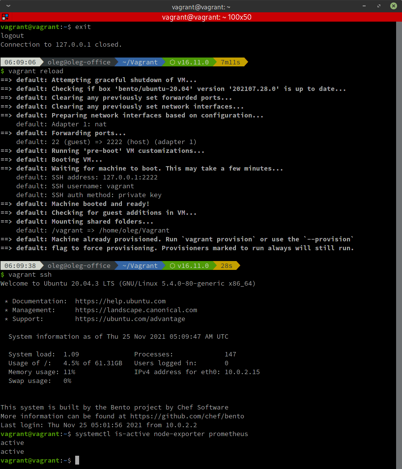

Наблюдается, что службы находятся в активном состоянии.

5. Также можно проконтролировать статус служб:
````
systemctl status node-exporter
systemctl status prometheus
````

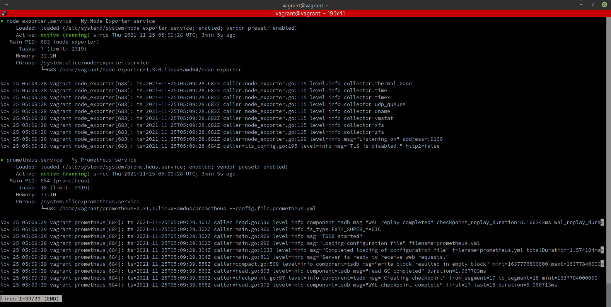

6. Можно убедиться в наличии возвращаемых службами метрик:
````
curl localhost:9100/metrics
curl localhost:9090/metrics
````

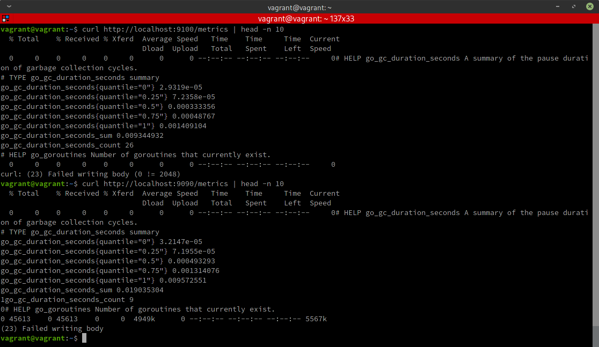

 ---
2. Ознакомьтесь с опциями node_exporter и выводом `/metrics` по-умолчанию. Приведите несколько опций, которые вы бы выбрали для базового мониторинга хоста по CPU, памяти, диску и сети.

Для конфигурирования сборощиков статистики (скреперов) "Node Exporter" изменим дополнительные параметры запуска, которые мы вынесли в отдельный файл `node_exporter.properties`:
````
EXTRA_OPTS=--collector.disable-defaults --collector.cpu --collector.meminfo --collector.diskstats --collector.netstat
````

Здесь мы отключили сборщики по умолчанию, но подключили сборщики:<br/>
`cpu` - статистика использования процессора(ов);<br/>
`meminfo` - статистика использования памяти;<br/>
`diskstats` - статистика записи/чтения дисков;<br/>
`netstat` - статистика использования сети, полученная из `/sys/class/net`.

Для того, чтобы изменения вступили в силу, необходимо перезапустить сервис "Node Exporter" командой:
````
systemctl restart node-exporter
````
Причем выполнять команду `systemctl daemon-reload` перед этим необязательно, потому что юнит-файлы не изменялись, а состояние файлов окружения сервис перечитает автоматически при запуске.

Убедимся, что настроенные сборщики статистики работают:

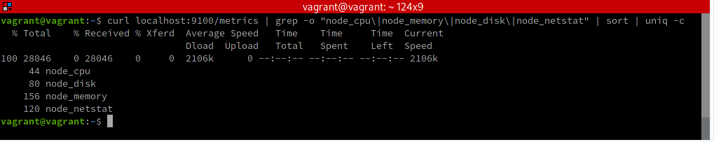

Как следует из полученного результата, сервис "Node Exporter" возвращает 44 строки статистки по процессору, 80 строк по дисковой активности, 156 строк по использованию памяти и 120 строк статистики относительно использования сети.

 ---
3. Установите в свою виртуальную машину [Netdata](https://github.com/netdata/netdata). Воспользуйтесь [готовыми пакетами](https://packagecloud.io/netdata/netdata/install) для установки (`sudo apt install -y netdata`). После успешной установки:
    * в конфигурационном файле `/etc/netdata/netdata.conf` в секции [web] замените значение с localhost на `bind to = 0.0.0.0`,
    * добавьте в Vagrantfile проброс порта Netdata на свой локальный компьютер и сделайте `vagrant reload`:

    ```bash
    config.vm.network "forwarded_port", guest: 19999, host: 19999
    ```

    После успешной перезагрузки в браузере *на своем ПК* (не в виртуальной машине) вы должны суметь зайти на `localhost:19999`. Ознакомьтесь с метриками, которые по умолчанию собираются Netdata и с комментариями, которые даны к этим метрикам.

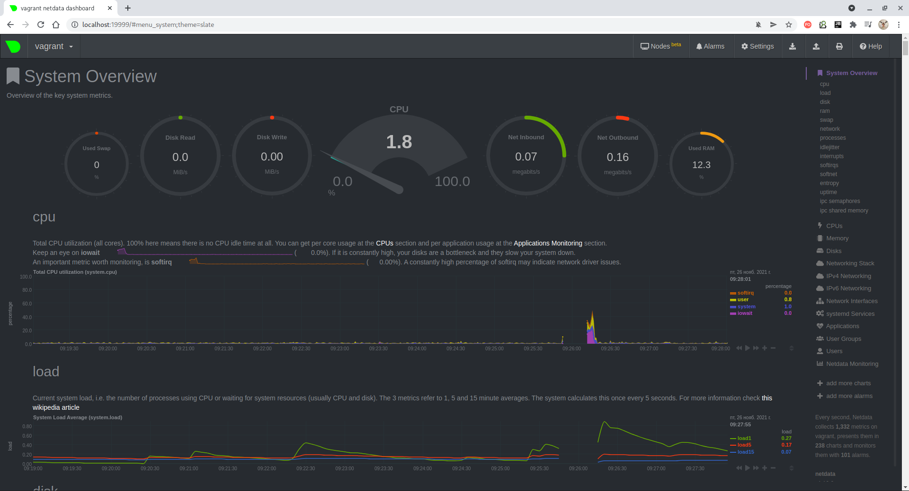

 ---
4. Можно ли по выводу `dmesg` понять, осознает ли ОС, что загружена не на настоящем оборудовании, а на системе виртуализации?

Команда `dmesg` (diagnostic message) используется для вывода буфера сообщений ядра в `stdout`.

Поиск по результату вывода даёт необходимый результат (верхний экран - реальная машина, нижний - виртуальная):

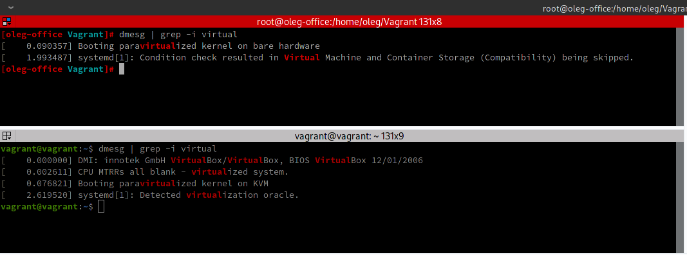

Из скриншота можно увидеть, что в случае загрузки на реальной машине ядро сообщает об этом:<br/>
`Booting paravirtualized kernel on bare hardware`,

а в случае виртуализации прямо указывается, какая технология виртуализации используется (здесь - это KVM):<br/>
`Booting paravirtualized kernel on KVM`

---
5. Как настроен sysctl `fs.nr_open` на системе по-умолчанию? Узнайте, что означает этот параметр. Какой другой существующий лимит не позволит достичь такого числа (`ulimit --help`)?

`fs.nr_open` (псевдофайл `/proc/sys/fs/nr_open`) задаёт максимальное количество файловых дескрипторов, которые может удерживать один процесс. Для разных сборок Linux оно разное, но для **Ubuntu 20.04** значение по умолчанию составляет **1048576**, что подразумевается достаточным для большинства машин. Максимально возможное значение хранится в переменной `sysctl_nr_open_max` ядра и составляет **2147483584** (около 2^31) для процессоров архитектуры x86_64.

`ulimit -n` сообщает/устанавливает максимальное количество открытых файлов для сессии и всех её процессов. Верхней границей для него является значение `fs.nr_open`. Соответственное, если нам нужно увеличить лимит открытых файлов, а это не получается, значит нужно проверить действующее значение `fs.nr_open`.

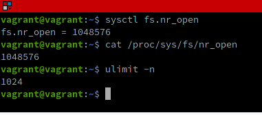

---
6. Запустите любой долгоживущий процесс (не `ls`, который отработает мгновенно, а, например, `sleep 1h`) в отдельном неймспейсе процессов; покажите, что ваш процесс работает под PID 1 через `nsenter`. Для простоты работайте в данном задании под root (`sudo -i`). Под обычным пользователем требуются дополнительные опции (`--map-root-user`) и т.д.

Верхнее окно - сеанс, исполняющий команду `sleep 1h` в отдельном пространстве имен, нижнее окно - пример захода в это пространство имен и просмотр запущенных в нём процессов:

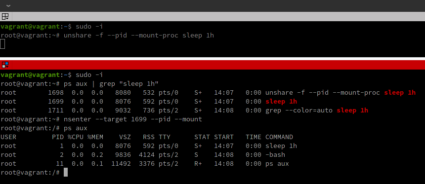

Как видно из скриншота, процесс, запущенный в новом пространстве имён, имеет **PID = 1**.

---
7. Найдите информацию о том, что такое `:(){ :|:& };:`. Запустите эту команду в своей виртуальной машине Vagrant с Ubuntu 20.04 (**это важно, поведение в других ОС не проверялось**). Некоторое время все будет "плохо", после чего (минуты) – ОС должна стабилизироваться. Вызов `dmesg` расскажет, какой механизм помог автоматической стабилизации. Как настроен этот механизм по-умолчанию, и как изменить число процессов, которое можно создать в сессии?

Данная команда бесконечно генерирует дочерние процессы, что в итоге может привести к падению системы.

Если отформатировать это выражение в традиционном виде и добавить номера строк, то получим:
````
Строка 1. :()
Строка 2. {
Строка 3.  :|:&
Строка 4. };
Строка 5. :
````

По шагам:<br/>
**Строка 1:** Объявляет функцию с именем `:` и без аргументов;<br/>
**Строка 2:** Начало тела функции;<br/>
**Строка 3:** Рекурсивный запуск этой же функции с передачей через "pipe" результатов еще одному запуску в фоновом режиме (без использования "pipe" рекурсии не происходит по-видимому из-за внутренней языковой оптимизации, исключающей зацикливание);<br/>
**Строка 4:** Конец тела функции;<br/>
**Строка 5:** Запуск объявленной функции;<br/>

Анализ событий через `dmesg` выявил сообщение `fork rejected by pids controller in /user.slice/user-1000.slice/session-7.scope`:

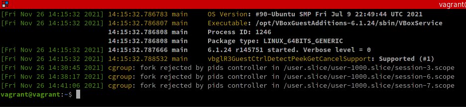

Это свидетельствует о срабатывании механизма ограничения процессов на каждого пользователя.

По-умолчанию, на данной системе этот лимит составляет 7732:

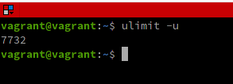

Для исключения подобного вида атак можно ограничить количество процессов на каждого пользователя, например, с помощью команды:<br/>
`ulimit -u <МаксКоличествоПроцессов>`.

---
