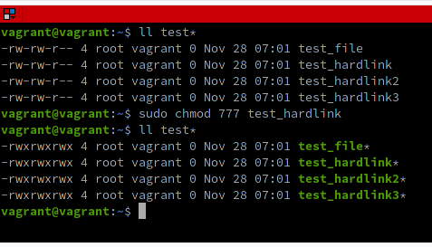
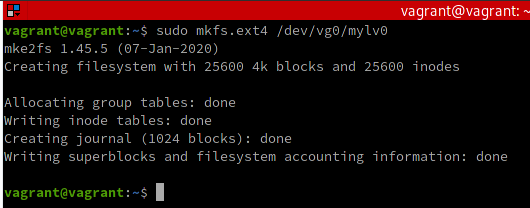
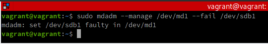

# Домашнее задание к занятию "3.5. Файловые системы"

---
 1. Узнайте о [sparse](https://ru.wikipedia.org/wiki/%D0%A0%D0%B0%D0%B7%D1%80%D0%B5%D0%B6%D1%91%D0%BD%D0%BD%D1%8B%D0%B9_%D1%84%D0%B0%D0%B9%D0%BB) (разряженных) файлах.

Из [Википедии](https://ru.wikipedia.org/wiki/%D0%A0%D0%B0%D0%B7%D1%80%D0%B5%D0%B6%D1%91%D0%BD%D0%BD%D1%8B%D0%B9_%D1%84%D0%B0%D0%B9%D0%BB):

**Разрежённый файл** - файл, в котором последовательности нулевых байтов заменены на информацию об этих последовательностях (список дыр).

**Дыра** - последовательность нулевых байт внутри файла, не записанная на диск. Информация о дырах (смещение от начала файла в байтах и количество байт) хранится в метаданных файловой системы.

###### Преимущества:
- экономия дискового пространства. Использование разрежённых файлов считается одним из способов сжатия данных на уровне файловой системы;
- отсутствие временных затрат на запись нулевых байт;
- увеличение срока службы запоминающих устройств.

###### Недостатки:
- накладные расходы на работу со списком дыр;
- фрагментация файла при частой записи данных в дыры;
- невозможность записи данных в дыры при отсутствии свободного места на диске;
- невозможность использования других индикаторов дыр, кроме нулевых байт.

---
2. Могут ли файлы, являющиеся жесткой ссылкой на один объект, иметь разные права доступа и владельца? Почему?

Каждый файл представляет собой совокупность данных:
- структура `stat`, хранящая  набор метаданных файла (в т.ч. уникальный идентификатор файла `inode` - в поле `st_ino`, устройства - `st_rdev`, владельцев - `st_uid` и `st_gid` , права доступа - `st_mode `и т.п);
- имя файла, хранимое в структуре `directory` родительской директории файла и сопоставленное с `inode` файла;
- реальные данные, хранимых на диске.

Сопоставление между метаданными файла и реальными данными на диске обеспечивается специальным объектом - **"жесткой ссылкой"** - хранимой в файловой таблице (таких ссылок м.б. множество и их количество учитывается в структуре метаданных файла в поле `st_nlinks`). Соответственно, владельцев у жестких ссылок как таковых вовсе нет - это атрибут самого файла.

В этом легко убедится, создав файл и несколько жестких ссылок на него, а затем изменив владельца у любого из них - владельцы изменятся у всех, потому что фактически этот один и тот же файл: 


Ровно то же самое происходит при изменении прав доступа к файлу, пользуясь любой из жестких ссылок:



Все права у всех жестких ссылок изменились одинаково, ведь это один и тот же файл, в чём легко убедиться, взглянув на идентификаторы `inode` этих файлов - они все одинаковые (здесь - 131081):


---
 3. Сделайте `vagrant destroy` на имеющийся инстанс Ubuntu. Замените содержимое Vagrantfile следующим:

````bash
Vagrant.configure("2") do |config|
  config.vm.box = "bento/ubuntu-20.04"
  config.vm.provider :virtualbox do |vb|
    lvm_experiments_disk0_path = "/tmp/lvm_experiments_disk0.vmdk"
    lvm_experiments_disk1_path = "/tmp/lvm_experiments_disk1.vmdk"
    vb.customize ['createmedium', '--filename', lvm_experiments_disk0_path, '--size', 2560]
    vb.customize ['createmedium', '--filename', lvm_experiments_disk1_path, '--size', 2560]
    vb.customize ['storageattach', :id, '--storagectl', 'SATA Controller', '--port', 1, '--device', 0, '--type', 'hdd', '--medium', lvm_experiments_disk0_path]
    vb.customize ['storageattach', :id, '--storagectl', 'SATA Controller', '--port', 2, '--device', 0, '--type', 'hdd', '--medium', lvm_experiments_disk1_path]
  end
end    
````

Данная конфигурация создаст новую виртуальную машину с двумя дополнительными неразмеченными дисками по 2.5 Гб.

---
4. Используя `fdisk`, разбейте первый диск на 2 раздела: 2 Гб, оставшееся пространство.

Для начала получим информацию о доступных блочных устройствах:


Будем надеяться, что под _первым_ диском имелось всё же ввиду устройство **sdb**.

Вызовем приложение fdisk для его разбиения:

````
sudo fdisk /dev/sdb
````

Приложение запуститься в интерактивном режиме и ответим на вопросы следующим образом:
````
Partition type: p
Partition number (1-4, default 1): 1
First sector (2048-5242879, default 2048): 2048
Last sector, +/-sectors or +/-size{K,M,G,T,P} (2048-5242879, default 5242879): +2GB
````

В результате fdisk создаст раздел диска и сообщит об этом:

````
Created a new partition 1 of type 'Linux' and of size 1.9 GiB.
````

Командой `w` сохраним созданный дисковый раздел.

Для создания еще одного дискового раздела, включающего всё остальное пространство на данном диске снова вызовем процедуру создания разбиения, указав все параметры по умолчанию, чтобы fdisk автоматически распределил пространство:


Пространство устройства `sdb` полностью распределено, что можно увидеть, воспользовавших программой `parted`:


---
5. Используя `sfdisk`, перенесите данную таблицу разделов на второй диск.

Создадим файл с параметрами таблицы разделов:
````
sudo sfdisk -d /dev/sdb > my_partition_table
````

Это простой текстовый файл. Отредактируем его, изменив имя блочного устройства на то, к которому данный файл собираемся применять:


Т.е. мы просто поменяли `/dev/sdb` на `/dev/sdc`.

Теперь можно применить таблицу разделов на другое блочное устройство:


Т.о. программа `sfdisk` создала новое разбиение на устройстве `/dev/sdc` и его пространство тоже полностью распределено, что можно увидеть, воспользовавших программой `parted`:


Полный список блочных устройств также отобразил созданные дисковые разделы: 


---
6. Соберите `mdadm` RAID1 на паре разделов 2 Гб.

Массив RAID1 представляет собой простое зеркалирование дисков, обеспечивающее минимальную избыточность, когда каждый из дисков массива хранит полный набор данных.

Всё делается одной командой, в которой указываем имя создаваемого массив, тип RAID, количество и имена используемых разделов:
````
sudo mdadm --create /dev/md1 --level=1 --raid-devices=2 /dev/sdb1 /dev/sdc1
````

После чего будет создан массив типа RAID1 под именем `/dev/md1`:


Из отчета видно, что `/dev/md1` использует два устройства `/dev/sdb1` и `/dev/sdc1`.

---
7. Соберите `mdadm` RAID0 на второй паре маленьких разделов.

Аналогично RAID1 из предыдущего задания, всё делается одной командой, но указыватся другой тип массива (имя устройства тоже, разумеется, зададим другое, как и используемые разделы):
````
sudo mdadm --create /dev/md0 --level=0 --raid-devices=2 /dev/sdb2 /dev/sdc2
````

Программа `lsblk` также охотно отобразит созданный массив RAID0:


---
8. Создайте 2 независимых PV на получившихся md-устройствах.

Физические устройства (Physical Devices) создаются одной командой применительно к каждому из ранее созданных RAID-массивов:

````
pvcreate /dev/md1
pvcreate /dev/md0
````

После чего можно увидеть их параметры:


Следует заметить, что RAID0 стал больше, потому что состоит из двух разделов по 0.6GB каждый, а RAID1 остался таким же, хотя и состоит из двух разделов по 2GB каждый. Это обусловлено концепциями их построения.

---
9. Создайте общую volume-group на этих двух PV.

Группа томов создается одной командой с указанием имени создаваемой группы и участвующих физических устройств:

````
sudo vgcreate vg0 /dev/md0 /dev/md1
````

После чего можно увидеть её параметры:


Обращаем внимание, что объем созданной группы равен сумме объемов входящих в неё физических устройств: 1.27GB + 1.86GB = 3.12GB. 

---
10. Создайте LV размером 100 Мб, указав его расположение на PV с RAID0.

Создание логического тома (Logical Volume) с использованием определенного физического тома из группы томов производится одной командой:
````
sudo lvcreate -L 100M -n mylv0 vg0 /dev/md0
````

Здесь мы создаём логический том с именем `mylv0` на основе физического тома `/dev/md0` (именно он у нас построен на RAID0), входящего в группу томов `vg0`.

Можно выяснить статус созданного логического тома:


Также можно получить информацию об имеющихся логических томах, где мы увидим, какой физический том используется для логического тома:


Другим способом получить информацию о связи логических и физических томов можно выполнив команду `pvdisplay` с ключом `-m`:


Выведенная информация свидетельствует, что физический том `/dev/md0` содержит логический том `/dev/vg0/mylv0`.

Аналогично, созданный логический том прослеживается в списке блочных устройств:


---
11. Создайте `mkfs.ext4` ФС на получившемся LV.

Для этого достаточно одной команды с указанием имени логического тома:



Проверить тип созданной файловой системы можно, выведя список блочных устройств с указанием файловых систем:


Видим, что логический том `/dev/vg0/mylv0` использует файловую систему `ext4`.

---
12. Смонтируйте этот раздел в любую директорию, например, `/tmp/new`.

Одна команда:
````
sudo mount /dev/vg0/mylv0 /tmp/new
````

---
13. Поместите туда тестовый файл, например `wget https://mirror.yandex.ru/ubuntu/ls-lR.gz -O /tmp/new/test.gz`.
````
wget https://mirror.yandex.ru/ubuntu/ls-lR.gz -O /tmp/new/test.gz
````

---
14. Прикрепите вывод `lsblk`.

После скачивание файла в директорию логического тома мы видим, что занято 23% от 100МБ (размер файла как раз 22.5МБ), а осталось, соответственно 64.3МБ доступного места:


Также удобно указывается точка монтирования логического тома `/tmp/new`.

---
15. Протестируйте целостность файла:

    ````bash
    root@vagrant:~# gzip -t /tmp/new/test.gz
    root@vagrant:~# echo $?
    0
    ````

Файл архива не поврежден:


---
16. Используя pvmove, переместите содержимое PV с RAID0 на RAID1.

Одна команда. Процесс м.б. длительным, поэтому сопровождается выводом прогресса:


Но вывод информации об устройствах покажет, что логический том `/dev/vg0/mylv0` теперь находится в RAID1 (`/dev/md1`), а не в RAID0 (`/dev/md0`), как прежде:


---
17. Сделайте `--fail` на устройство в вашем RAID1 md.

Допустим, что вышло из строя устройство `/dev/sdb1`, которое задействовано в массиве RAID1 `/dev/md1`:


Пометим его, как неисправное командой `sudo mdadm --manage /dev/md1 --fail /dev/sdb1`:



---
18. Подтвердите выводом `dmesg`, что RAID1 работает в деградированном состоянии.

В журнале ядра событие пометки устройства в качестве неисправного сопровождается соответствующей записью:


---
19. Протестируйте целостность файла, несмотря на "сбойный" диск он должен продолжать быть доступен:

    ```bash
    root@vagrant:~# gzip -t /tmp/new/test.gz
    root@vagrant:~# echo $?
    0
    ```

Несмотря на повреждение диска файл наблюдается в системе и сохраняет целостность:


---
 20. Погасите тестовый хост, `vagrant destroy`.

---