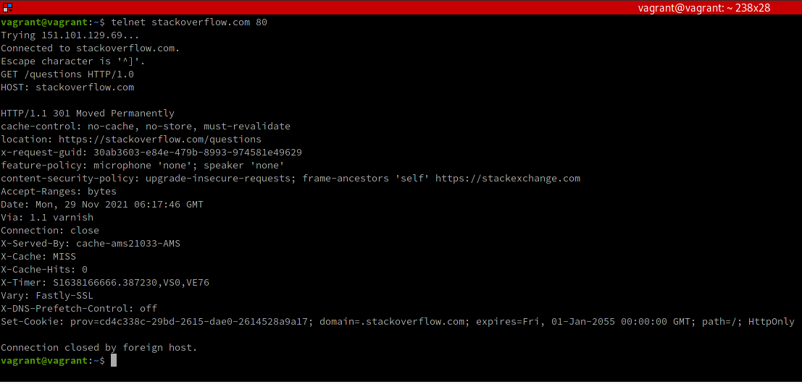
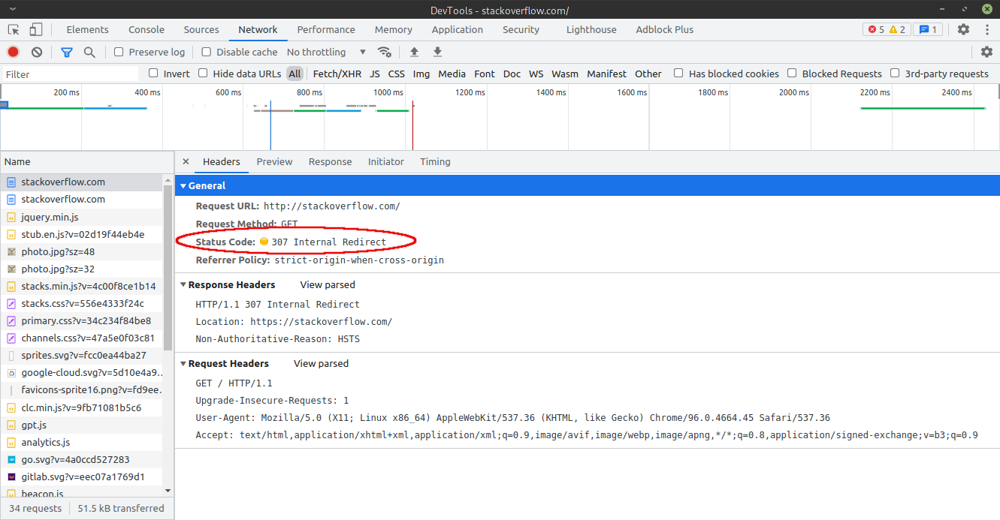
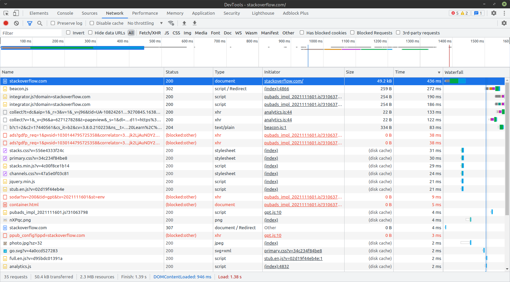
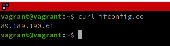
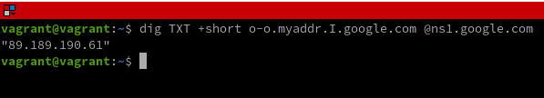
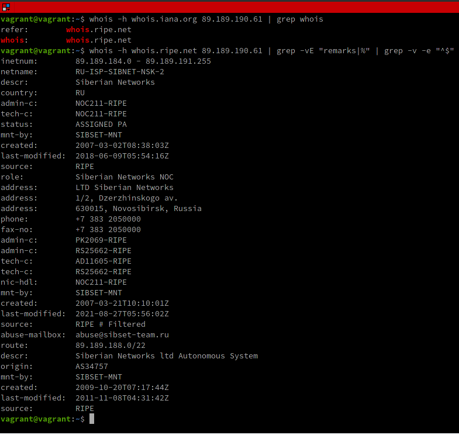
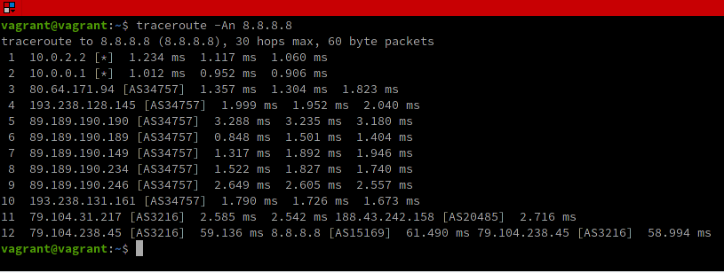
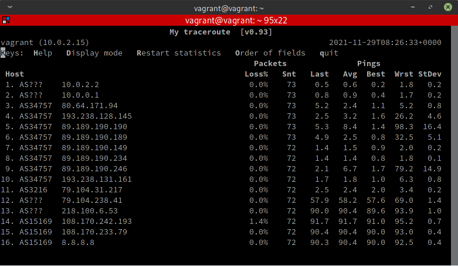
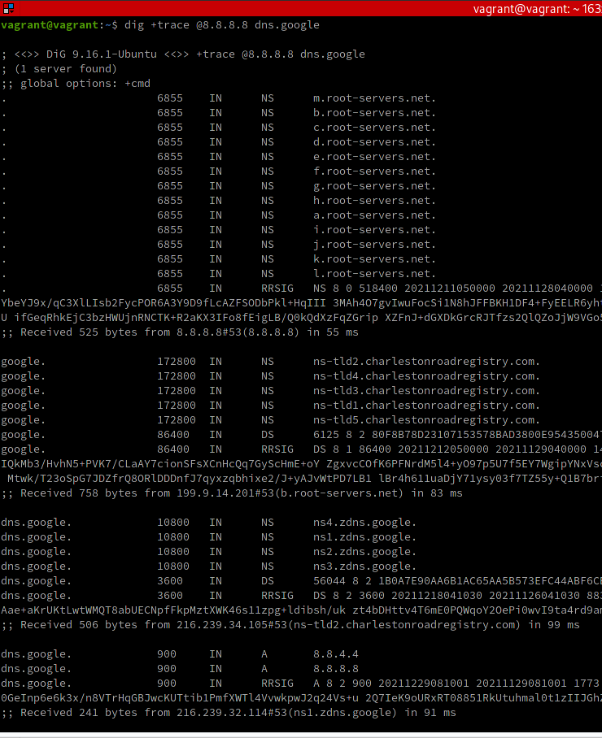
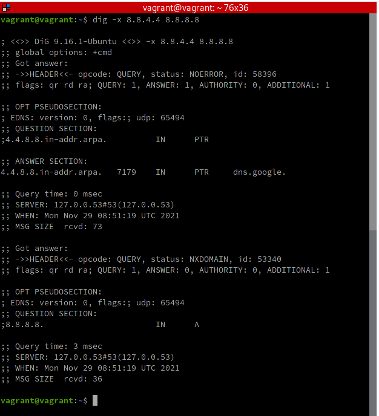

# Домашнее задание к занятию "3.6. Компьютерные сети, лекция 1"

---
1. Работа c HTTP через телнет.
- Подключитесь утилитой телнет к сайту stackoverflow.com
`telnet stackoverflow.com 80`
- отправьте HTTP запрос
```bash
GET /questions HTTP/1.0
HOST: stackoverflow.com
[press enter]
[press enter]
```
- В ответе укажите полученный HTTP код, что он означает?



Код ответа 301 - "Moved Permanently". "Перемещён на постоянной основе". Этот код ответа значит, что URI запрашиваемого ресурса был изменён. Возможно, новый URI будет предоставлен в ответе в поле `Location` заголовка. Здесь он предоставлен и предлагает обратиться по адресу `stackoverflow.com/questions` пользуясь протоколом `https`. 

---
2. Повторите задание 1 в браузере, используя консоль разработчика F12.
- откройте вкладку `Network`
- отправьте запрос http://stackoverflow.com
- найдите первый ответ HTTP сервера, откройте вкладку `Headers`
- укажите в ответе полученный HTTP код.
- проверьте время загрузки страницы, какой запрос обрабатывался дольше всего?
- приложите скриншот консоли браузера в ответ.

Первый ответ сервера - это 307 "Internal/Temporary Redirect", чтобы клиент получил запрошенный ресурс на другой URL-адрес с тем же методом (здесь - GET).



Отсортировав запросы по таймингу, выясним, что больше всего времени занял перенаправленный запрос на `https://stackoverflow.com/` - 436 миллисекунд:



---
3. Какой IP адрес у вас в интернете?

Для того, чтобы узнать свой внешний адрес можно воспользоваться многочисленными сервисами, возвращающими IP-адрес клиента.
Пример использования такого сервиса `ifconfig.co` через **curl**:



Или можно воспользоваться утилитой **dig**:



---
4. Какому провайдеру принадлежит ваш IP адрес? Какой автономной системе AS? Воспользуйтесь утилитой `whois`

Утилита whois, как и одноименный протокол, предназначена для получения регистрационных данных о владельцах доменных имен, IP-адресов и автономных системах.

Наиболее актуальные регистрационные данные можно получить с whois-серверу конкретной зоны, к которой относится IP-адрес.
Чтобы выяснить текущий whois-серверу обратимся, например, к whois-серверу IANA (организация, занимающаяся управлением пространствами IP-адресов и доменов верхнего уровня) и, получив имя локального whois-сервера, обратимся к нему за детальной информацией:



Провайдер "Siberian Networks ltd Autonomous System" (также приведена контактная информация), автономная система AS34757.

Впрочем, задачу можно было бы и упростить, просто вызвал `whois` без указания whois-сервера. Тогда локальный whois-сервер был бы использован автоматически.

---
5. Через какие сети проходит пакет, отправленный с вашего компьютера на адрес 8.8.8.8? Через какие AS? Воспользуйтесь утилитой `traceroute`



IP-адреса сетей, через которые проходят пакеты, отображены в начале каждой строки. Здесь начинается с IP-адреса `10.0.2.2` и заканчивается IP-адресом `79.104.238.45`.
Автономные сети указаны в квадратных скобках вслед за IP-адресами. Если указана звездочка `[*]`, значит информация об AS очередным маршрутизатором не была предоставлена.

Разберем движение пакетов по этапам:<br/>
**Этап 1.** Первый этап, два адреса, 10.0.2.2 => 10.0.2.2, не предоставившие данные о своих AS - это, очевидно, внутренние маршрутизаторы организации;<br/>
**Этап 2.** Далее пакеты попадают к автономной точке **AS34757** (Новосибирск) и путешествуют от одного адреса к другому (80.64.171.94 => 2193.238.128.145 => 89.189.190.190 => 89.189.190.189 => 89.189.190.149 => 89.189.190.234 => 89.189.190.246 => 193.238.131.161), по-видимому, это внутренняя маршрутизация интернет-провайдера;<br/>
**Этап 3.** Далее пакеты попадают к **AS3216** (IP 79.104.31.217 => 79.104.238.45, Москва);<br/>
**Этап 4.** Пакеты перенаправляются к **AS15169** (США).

---
6. Повторите задание 5 в утилите `mtr`. На каком участке наибольшая задержка - delay?



Одного взгляда на представленную утилитой удобную таблицу (команда запуска - `mtr -zn 8.8.8.8`) достаточно, чтобы понять, что наибольшая средняя задержка за все время наблюдений составила 91.7 миллисекунды на маршруте от **AS3216** (Москва) к **AS15169** (США), но и в целом, сегмент США довольно медленный (у всех задержака около 90 миллисекунд). Кроме того, в сегменте AS15169 наблюдалась потеря 1.4% пакетов.

Впрочем, самая большая задержка за время наблюдений зарегистрирована в **AS34757** (Новосибирск) и составляет 98.3 миллисекунды.

---
7. Какие DNS сервера отвечают за доменное имя dns.google? Какие A записи? воспользуйтесь утилитой `dig`

Запустив утилиту командой `dig +trace @8.8.8.8 dns.google` получаем:



Как видим, авторизованные DNS-сервера помечены как **"NS"** и их у Google 12 штук. Непосредственно записи `dns.google.` содержат 4 из них:

- dns.google.		10800	IN	NS	ns1.zdns.google.
- dns.google.		10800	IN	NS	ns2.zdns.google.
- dns.google.		10800	IN	NS	ns3.zdns.google.
- dns.google.		10800	IN	NS	ns4.zdns.google.

Серверов типа **"A"**, отвечающих за сопоставление имени с IP-адресом типа IPv4 всего два:

- dns.google.		900	IN	A	8.8.4.4
- dns.google.		900	IN	A	8.8.8.8

---
8. Проверьте PTR записи для IP адресов из задания 7. Какое доменное имя привязано к IP? воспользуйтесь утилитой `dig`

Как уже отмечалось в предыдущем задании у Google 2 сервера типа **"A"**:

- dns.google.		900	IN	A	8.8.4.4
- dns.google.		900	IN	A	8.8.8.8

Проверим оба из них вызвав приложение Dig командой `dig -x 8.8.4.4 8.8.8.8`:



Как следует из результата, к IP 8.8.4.4 привязано доменное имя `dns.google.`.

---