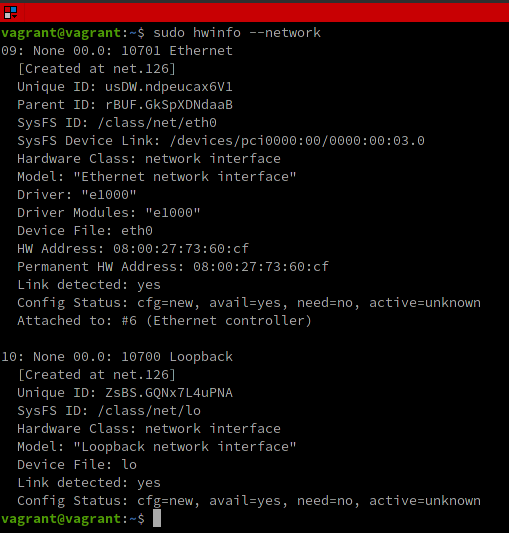
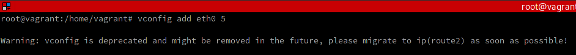

# Домашнее задание к занятию "3.7. Компьютерные сети, лекция 2"

---
1. Проверьте список доступных сетевых интерфейсов на вашем компьютере. Какие команды есть для этого в Linux и в Windows?

В Linux существует большое количество способом просмотреть сетевую конфигурацию. Например можно воспользоваться командой `ifconfig` или пришедшей ей на смену командой `ip`:


Похожий результат позволяет получить другая команда - `netstat`:


Программа `hwinfo` позволяет получить детализированную информацию об оборудовании: 



Физические сетевые интерфейсы можно увидеть и путем просмотра оборудования какой-либо из соответствующих программ, например `lshw` или `lspci`: 


Кроме того, доступные сетевые интерфейсы можно увидеть через их файловые представления в `/sys/class/net` или статистику `/proc/net/dev`:


В Windows наиболее популярной командой является `ipconfig /all`: 


---
2. Какой протокол используется для распознавания соседа по сетевому интерфейсу? Какой пакет и команды есть в Linux для этого?

Для оповещения обородования о своём существовании применяется протокол **LLDP (Link Layer Discover Protocol)** работающий на канальном уровне (опрос организован через отправку LLDP-кадров через все порты оборудования через фиксированные интервалы времени). Собранная таким образом информация накапливается в устройствах и т.о. позволяет путём последовательного опроса этих устройств составить представление о топологии сети. Получаемая информация содержит помимо прочего IP-адрес устройства, что позволяет устройству создавать ARP-таблицу, храняющую сопоставление IP- и MAC-адресов. Для работы с такими таблицами используется ARP-протокол*.

````
*ARP (Address Resolution Protocol) - коммуникационный протокол, используемым в IPv4 сетях (для IPv6 применяется Neighbour Discovery Protocol).
Этот протокол преобразует IP-адрес устройства в его физический MAC (Media Access Control)-адрес.
ARP-функции позволяют пользователю манипулировать ARP-кэшем или ARP-таблицей, хранящих такие сопоставления.
````

Команда `arp`, как и многие другие функции для работы с сетями, находится в пакете `net-tools`. Но в версиях Linux от 2.2 и выше на смену команде `arp` приходит другая команда - `ip`, имеющая схожий функционал.

Результат вызова команд на виртуальной машине приведен на скриншоте:


Как видим, соседи представлены двумя IP-адресами и сопоставлены с двумя MAC-адресами устройств, находящихся в состоянии `REACHABLE`.

При этом возможны следующие состояния:
- Incomplete — Процесс разрешения адреса еще не завершен, сосед не отвечает;
- Reachable — сосед известен и доступен;
- Stale — ранее известный сосед недоступен, действий для выяснения доступности не предпринято;
- Delay — ранее известный сосед недоступен, интерфейс в состоянии ожидания подтверждения доступности;
- Probe — ранее известный сосед недоступен, запрос на доступность отправляется.

---
3. Какая технология используется для разделения L2 коммутатора на несколько виртуальных сетей? Какой пакет и команды есть в Linux для этого? Приведите пример конфига.

Разделить L2-коммутатор (т.е. коммутатор, манипулирующий MAC-адресами) на несколько независимых сетей позволяет технология виртуальных сетей - **VLAN (Virtual Local Area Network)**. Эта технология использует подход "тегированных" пакетов, когда каждый пакет обладает меткой (т.наз. `dot1q`, от названия соответствующего стандарта - `802.1Q`), позволяющей определить, к какой виртуальной сети он относится. Это позволяет манипулировать такими пакетами независимо.

Для Linux использование технологии VLAN реализовано в одноименном пакете `vlan`, использующим возможности ядра и реализованной в нём поддержки стандарта `IEEE 802.1Q`.

````bash
Согласно данному стандарту заголовок кадра не изменяется, чтобы сетевые устройства могли передавать такой трафик без учета его принадлежности к VLAN, но внутрь фрейма помещается специальный тег, размером 4 байта, позволяющий относить такой пакет к той или иной виртуальной сети.
````

В качестве примера покажем несколько вариантов настройки VLAN на Ubuntu 20.04.

Для начала убедимся, что драйвер ядра Linux 8021q загружен:


Все нормально, модуль ядра присутствует. Теперь проверим наличие физических сетевых интерфейсов:


Видим, что присутствует физический интерфейс `eth0` и решаем, что нам нужно создать на нём VLAN-интерфейс с тегом, например, "5". Для этого можно воспользоваться командой `vconfig`:



Как видим, команда предупреждает, что она **устаревшая и, в дальнейшем, следует отказаться от её использования**.

Далее, настроим параметры созданного интерфейса командой `ifconfig` и выведем подробную информацию о созданном интерфейсе, содержащуюся в файле `/proc/net/vlan/eth0.5`:


Созданный интерфейс теперь присутствует в списке сетевых интерфейсов системы:


Удалить созданные интерфейс можно командами `ifconfig down` и `vconfig rem`, после чего он перестаёт наблюдаться в системе:


Кроме того, созданные таким образом VLAN-интерфейсы **после перезагрузки системы воссозданы не будут** и исчезнут.
Для того, чтобы они восстанавливались при перезагрузке, соответствующие команды следует разместить в конфигурационном файле `/etc/network/interfaces` и воспользоваться, например, командой `iface`:


Здесь мы объявляем сразу три VLAN-интерфейса - `eth0.5`, `eth0.6` и `eth0.7` и можем их наблюдать в сетевом окружении после перезагрузки системы:


Также существуют другие способы создания VLAN-интерфейсов - командой `ip`, `netplan` и пр.

````
#Создаём командой `ip`:
ip link add link eth0 name eth0.5 type vlan id 5
ip -d link show eth0.5

#Настраиваем командой `ip`:
ip addr add 192.168.1.100/24 brd 192.168.1.255 dev eth0.5
ip link set dev eth0.5 up

#Удаляем командой `ip`:
ip link set dev eth0.5 down
ip link delete eth0.5
````

Суть действий аналогична и для краткости разбирать их здесь не будем.

---
4. Какие типы агрегации интерфейсов есть в Linux? Какие опции есть для балансировки нагрузки? Приведите пример конфига.

Агрегация (объединение) нескольких параллельных каналов передачи данных призвана увеличить пропускную способность и повысить надёжность соединения.
На практике агрегирование нескольких стандартных каналов оказывается более надёжным и выгодным, чем поддержание работоспособности одного, но более производительного устройства.
Для агрегирования каналов используется LACP (Link Aggregation Control Protocol) - открытый протокол, хотя многие производители оборудования используют из закрытые технологии (Cisco применяет EtherChannel или PAgP).
Существует два типа агрегации интерфейсов (Link Aggregation Group):
- статический (Static Link Aggregation) - все настройки задаются на обеих сторонах соединения один раз;
- динамический (Dynamic Link Aggregation) - обе стороны договариваются о параметрах соединения, что позволяет, например, поддерживать работоспособность сети в случае выхода каких-либо соединений из строя. Обмен данными производится по протоколу LACP (Link Aggregation Control Protocol). 

В Linux существует две основных опции балансировки нагрузки:
- **связывание (bonding)** - создаётся связка двух или более физических сетевых интерфейсов в один логический интерфейс для повышения отказоустойчивости и избыточности сети.

````
 При связывании (bonding) полоса пропускания сети (bandwidth) возрастает и теоретически, например, можно получить на двух интерфейсах по 1Gbs один канал на 2Gbs.
````

- **сопряжение (teaming)** - то же связывание, но с помощью специального драйвера, позволяющего использовать любой из драйверов оборудования в зависимости от необходимости. Teaming считается более продвинутым подходом, потому что предоставляет больше возможностей и меньше нагружает вычислительные мощности оборудования.

````
При объединении (teaming) два интерфейса по 1Gb/sec не дадут создать один канал на 2Gbs, но позволят создать один канал на 1Gbs и плюс еще один такой же канал в качестве резервного. В случае появления еще одного одновременного подключения, будет задействован этот резервный канал и таким образом суммарная пропускная способность может достигнуть 2Gbs.
````

 Пример конфигурирования через bonding (файл `/etc/network/interfaces`) двух интерфейсов - проводного и беспроводного. Проводной имеет приоритет и переключение на беспроводной происходит только при отключении проводного. При восстановлении проводного подключения оно снова становится основным (это типичный подход для ноутбуков, которые можно подключать через RJ45 для получения более скоростного соединения по сравнению с Wi-Fi):
````
# Define slaves   
auto eth0
iface eth0 inet manual
    bond-master bond0
    bond-primary eth0
    bond-mode active-backup
   
auto wlan0
iface wlan0 inet manual
    wpa-conf /etc/network/wpa.conf
    bond-master bond0
    bond-primary eth0
    bond-mode active-backup

# Define master
auto bond0
iface bond0 inet dhcp
    bond-slaves none
    bond-primary eth0
    bond-mode active-backup
    bond-miimon 100
````

С внешней стороны не будет разницы, какой из интерфейсов в данный момент активен - наружу демонстрируется только виртуальный MAC-адрес, отличающийся от MAC-адресов обеих единиц физического оборудования. Соответственно, DHCP сервер, использующий MAC-адреса для идентификации оборудования и назначения текущего IP-адреса, никакой разницы тоже не увидит.

Для разного оборудования и операционных систем конфигурационный файл для одной и той же ситуации может различаться.

---
5. Сколько IP адресов в сети с маской /29 ? Сколько /29 подсетей можно получить из сети с маской /24. Приведите несколько примеров /29 подсетей внутри сети 10.10.10.0/24.

Маска **/29** означает, что только три бита из 32-х (30-й, 31-й и 32-й) свободны для адресов хостов внутри подсети. Три бита позволяют получить 8 комбинаций, т.е. 8 значений адресов, но один из них резервируется под адрес самой подсети и один - под широковещательные сообщения, т.о. остаётся 6 свободных адресов для адресации хостов.

Для иллюстрации можно воспользоваться какой-нибудь программой, например, `ipcalc` (мета-адрес 0.0.0.0 используется исключительно для наглядности):


Из скриншота видно, что используются последние три бита адреса и доступных хостов в этом случае 6 штук. Минимальный адрес хоста 0.0.0.1, а максимальный - 0.0.0.6. Максимальный адрес подсети (здесь 0.0.0.7) резервируется для бродкаста, а минимальный адрес подсети (0.0.0.0) используется для идентификации самой сети и для адресации хостов не используются.

**Рассчитаем разбиение на подсети.**<br/>
Сеть **/24** имеет 8 бит для адресации хостов. Это 256 адресов. Ранее мы уже подсчитали, что каждая сеть **/29** предоставляет 8 адресов. Соответственно, 256/8 - это 32 подсети с маской **/29**. Но следует помнить, что 2 адреса в каждой подсети используются не для адресации хостов, а в качестве адреса сети, а также для широковещательных сообщений, а значит каждая из 32-х подсетей **/29** будет адресовать только 6 хостов. **Т.о. сеть с маской /24 можно использовать для организации 32 подсетей с маской /29, что в сумме позволит адресовать 32х6 = 192 хоста.**

Также можно рассчитать количество подсетей и простым арифметическим подходом:
- 29-24=5 - это пять дополнительных разрядов адресации имеет сеть /24 по сравнению с /29;
- 2^5=32 - это 32 адреса м.б. использовано для адресации подсетей внутри более крупной сети. 


Для проверки можно воспользоваться всё той же утилитой `ipcalc` и проверить, сколько подсетей потребуется для адресации 192 дополнительных хостов внутри сети **/24**:


И действительно, требуются подсети **/24**, 256 адресов, сводного места не остаётся.

Для получения примеров адресов **/29** подсетей внутри 10.10.10.0/24 сети можно, например, просто разбить весь диапазон от 0 до 255 на подддиапазоны с шагом 8 и помнить, что первый адрес каждого поддиапазона - это адрес подсети, а последний - адрес широковещательного сообщения. Соответственно:

- 10.10.10.0 - **адрес подсети**;
- 10.10.10.1 - адрес хоста;
- 10.10.10.2 - адрес хоста;
- 10.10.10.3 - адрес хоста;
- 10.10.10.4 - адрес хоста;
- 10.10.10.5 - адрес хоста;
- 10.10.10.6 - адрес хоста;
- 10.10.10.7 - **адрес бродкаста**;
- 10.10.10.8 - **адрес подсети**;
- 10.10.10.9 - адрес хоста;
- 10.10.10.10 - адрес хоста;
- 10.10.10.11 - адрес хоста;
- 10.10.10.12 - адрес хоста;
- 10.10.10.13 - адрес хоста;
- 10.10.10.14 - адрес хоста;
- 10.10.10.15 - **адрес бродкаста**;
- 10.10.10.16 - **адрес подсети**;
- 10.10.10.17 - адрес хоста;

и т.д.

Можно не заниматься расчетами самостоятельно, а снова воспользоваться утилитой `ipcalc`, указав, на какие подсети следует разбить сеть (вывод на скриншоте сокращен из-за его длины):


Результат тот-же - 32 подсети, 192 хоста.

---
6. Задача: вас попросили организовать стык между 2-мя организациями. Диапазоны 10.0.0.0/8, 172.16.0.0/12, 192.168.0.0/16 уже заняты. Из какой подсети допустимо взять частные IP адреса? Маску выберите из расчета максимум 40-50 хостов внутри подсети.

Чтобы адресовать 40-50 хостов нужно 6 бит (5 бит даёт максимум 32 адреса, а этого мало, и не забываем отнять 2 адреса для сети и бродкаста). Т.е., уже можно придти к выводу, что нужна подсеть **/26** (32 бита минус 6 бит = 26 бит).

Можно подсчитать и с другой стороны:

- Первые 16 бит уже используются организациями для адресации существующих подсетей, значит нужна более длинная маска.
- 32 бита минус 16 бит используемых организациями = 16 бит всего доступно;
- 16 бит доступно минус 6 бит для адресации требуемого количества хостов = 10 незанятых бит для маски;
- 16 бит используемых организациями + 10 незанятых бит для маски = 26 бит для маски новой подсети.

Т.е. нужна подсеть **/26**, что позволяет адресовать 62 хоста.

Для выбора конкретного диапазона адресов обратимся к [RFC6890](https://datatracker.ietf.org/doc/html/rfc6890), где обнаружим, что все частные диапазоны IP-адресов (обозначены в документации как **Private-Use**), в нашем случае уже заняты, и нам придется прибегнуть к регламенту [RFC6598](https://datatracker.ietf.org/doc/html/rfc6598) "Shared Address Space" который рекомендует использовать адресное пространство **100.64.0.0/10** для обустройства CGNAT (Carrier-Grade Network Address Translation).

Подсеть из указанного пространства можно выбрать любую, например, самую первую - **100.64.0.0/26**, что нам даст **адреса хостов от 100.64.0.1 до 100.64.0.62** включительно.

---
7. Как проверить ARP таблицу в Linux, Windows? Как очистить ARP кеш полностью? Как из ARP таблицы удалить только один нужный IP?

 В Linux просмотреть ARP-таблицу можно, например, командами `arp` или `ip neighbour`, возвращающим одинаковый результат:


Полностью очистить ARP-кэш можно командой `ip -s -s neigh flush all`, а для удаления конкретной записи можно воспользоваться командой `apr -d <IpAddress>`:


В Windows, аналогично, существует команда `arp`:


В Windows очистка всего ARP-кэша осуществляется командой `arp -d`, а для удаления только определенной записи следует этой же команде передать IP-адрес удаляемой записи. 

---
