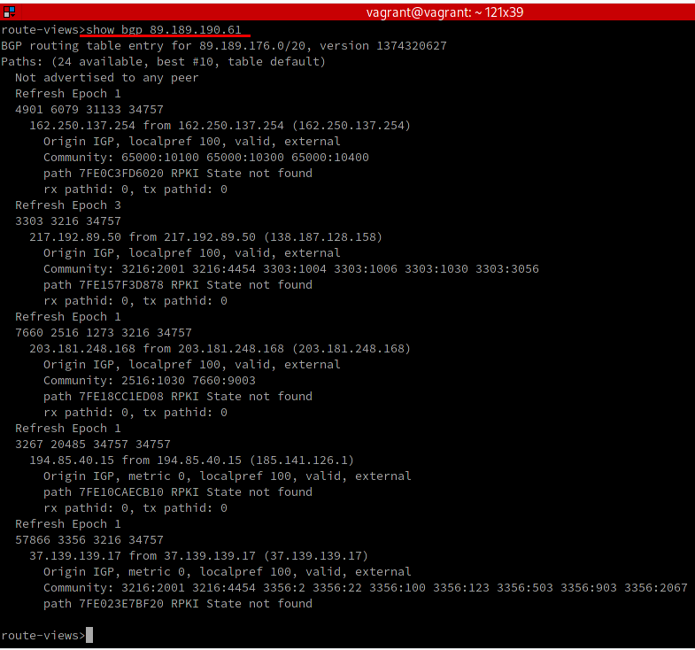

# Домашнее задание к занятию "3.8. Компьютерные сети, лекция 3"

---
1. Подключитесь к публичному маршрутизатору в интернет. Найдите маршрут к вашему публичному IP
```
telnet route-views.routeviews.org
Username: rviews
show ip route x.x.x.x/32
show bgp x.x.x.x/32
```

Сначала определим наш внешний IP-адрес любым способом:


Получили 89.189.190.61. Теперь запрашиваем маршрут к нему от `route-views.routeviews.org` (предварительно залогинившись):


и BGP-таблицу:



---
2. Создайте dummy0 интерфейс в Ubuntu. Добавьте несколько статических маршрутов. Проверьте таблицу маршрутизации.

Для работы dummy-интефейсов нужен модуль `dummy`. Укажем, что необходимо запускать этот модуль при старте системы, добавив в файл `/etc/modules` строку "dummy":
````
echo "dummy" >> /etc/modules
````

Создадим интерфейс:
````
ip link add dummy0 type dummy
````

Назначим ему IP-адрес:
````
ip addr add 10.1.1.1/32 dev dummy0
````

Переведем созданный dummy-интерфейс в активное состояние:
````
ip link set dummy0 up
````

Удалить интерфейс при необходимости можно командой `ip link del dummy0`.

Если нужно, чтобы интерфейс поднимался при старте системы, его необходимо объявить в файле `/etc/network/interfaces.d`, например, таким образом:
````
auto dummy0
iface dummy0 inet static
    address 10.1.1.1/32
    pre-up ip link add dummy0 type dummy
    post-down ip link del dummy0
```` 

Проверим состояние созданного интерфейса, например, командой `ip -c -br address`:


Созданный dummy-интерфейс наблюдается в списке сетевых интерфейсов системы.

Добавим временные статические маршруты, например, к сетям `10.1.2.1`, `10.1.3.1` и `10.1.4.1` (неважно, существуют они сейчас или нет) через этот интерфейс:
````
sudo ip route add 10.1.2.1/32 via 10.1.1.1
sudo ip route add 10.1.3.1/32 via 10.1.1.1
sudo ip route add 10.1.4.1/32 via 10.1.1.1
````
И проверим таблицу маршрутизации:


Как видим, переход в указанные сети будет осуществляться через созданный dummy-интерфейс.

---
3. Проверьте открытые TCP порты в Ubuntu, какие протоколы и приложения используют эти порты? Приведите несколько примеров.

Для просмотра портов можно использовать утилиту `ss`, пришедшую на смену утилите `netstat`. Например, проверим прослушиваемые процессами TCP-порты:


Здесь мы видим, что порты 6942, 63342 и 64128 прослушиваются некими java-процессами.

---
4. Проверьте используемые UDP сокеты в Ubuntu, какие протоколы и приложения используют эти порты?

Аналогично, можно просмотреть открытые процессами UDP-порты:


Т.к. UDP-протокол не использует сессии, то все порты имеют статус UNCONN.

А если существует активное UPD-подключение на какой-нибудь порт (его можно имитировать, например, командой `nc -u localhost 2333`), то такое подключение отобразится со статусом **ESTAB**:


---
5. Используя diagrams.net, создайте L3 диаграмму вашей домашней сети или любой другой сети, с которой вы работали. 


Ссылка: https://drive.google.com/file/d/1jL95NNmqwL0KqDCnvW5ZjsRe1MjA2aj_/view

---
