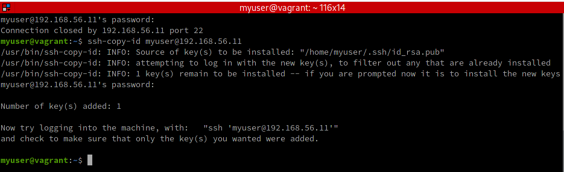
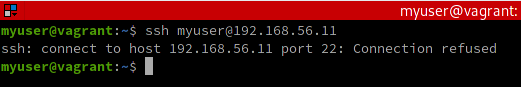

# Домашнее задание к занятию "3.9. Элементы безопасности информационных систем"

---
1. Установите Bitwarden плагин для браузера. Зарегистрируйтесь и сохраните несколько паролей.

Создано две записи для разных сайтов:


---
2. Установите Google authenticator на мобильный телефон. Настройте вход в Bitwarden-акаунт через Google authenticator OTP.

Имея аккаунт на `bitwarden.com`, настроим двухфакторную идентификацию, используя приложение Google Authenticator. Для этого включаем двухфакторную аутентификацию в личном кабинете на `bitwarden.com`:


Сканировав предложенный QR-код из мобильного приложения получаем генерацию временных кодов для двухфакторной аутентификации на `bitwarden.com`:


После этого, кроме аутентификационных данных, для логина на `bitwarden.com` нужно будет вводить еще и временный код, предлагаемые мобильным приложением. 

---
3. Установите apache2, сгенерируйте самоподписанный сертификат, настройте тестовый сайт для работы по HTTPS.

После установки и запуска локального экземляра "Apache 2":


Создадим простую страницу с фразой "**Hello self-signed certificate!**", разместим её на сервере и проверим общую работоспособность по незащищенногому протоколу **HTTP**:


Как видим, веб-сервер функционирует.

Теперь переведем его на использование защищенного **HTTPS**-соединения.

Сгенерируем самоподписанный SSL-сертификат:

````bash
sudo openssl req -x509 -nodes -days 3650 -newkey rsa:2048
 -keyout /etc/ssl/private/apache-selfsigned.key 
 -out /etc/ssl/certs/apache-selfsigned.crt 
 -subj "/C=RU/ST=Novosib/L=Novosib/O=Bacup IT/OU=Org/CN=www.example.com"
````

В файле `/etc/apache2/sites-available/example_com.conf`, описывающем конфигурацию сервера, укажем, какие  SSL-сертификаты должны использоваться для шифрования:

````bash
<VirtualHost *:443>
  ServerName example.com
  DocumentRoot /var/www/example.com

  SSLEngine on
  SSLCertificateFile /etc/ssl/certs/apache-selfsigned.crt
  SSLCertificateKeyFile /etc/ssl/private/apache-selfsigned.key
</VirtualHost>
````

Проверим работоспособность веб-сервера теперь уже по протоколу `HTTPS`:


Как видим, при использовании HTTPS-протокола под утилита `curl` нас предупреждает, что сертификат является самоподписанным и проверить его легитимность не удаётся. Это происходит потому, что самоподписанный сертификат никак не зарегистрирован в сертификационном центре (**CA, Certificate Authority**) и никакой доверенной информации о нём получить нельзя. 

Всё же, можно указать `curl` игнорировать отсутствие **CA** и всё равно подлючиться к серверу. Как видим, командой `curl https://localhost:443 -k` по протоколу `HTTPS` удалось получить данные сайта.

При подключении через браузер, после согласия с потенциальным риском, также удаётся получить данные с сайта по протоколу `HTTPS`:


---
4. Проверьте на TLS уязвимости произвольный сайт в интернете.

Проведем быстрый тест сайта **ya.ru**:


Проверим этот же сайт на уязвимости:


Как видим, уязвимости присутствуют, но замечания носят рекомендательный характер. 

---
5. Установите на Ubuntu ssh сервер, сгенерируйте новый приватный ключ. Скопируйте свой публичный ключ на другой сервер. Подключитесь к серверу по SSH-ключу.

На машине-клиенте генерируем пару ключей (публичный-приватный):


Копируем их любым способом на машину, к которой нужен доступ по ssh-подключению. Здесь воспользуемся утилитой `ssh-copy-id`:



Видим, что содержимое публичного ключа скопировано на целевую машину в папку пользователя в директорию `.ssh`:


В том, что это именно публичный ключ, легко убедиться, просмотрев содержимое файла `id_rsa.pub` на той машине, на которой он был сгенерирован (на клиентской машине):


Как видим, содержимое публичного ключа на клиентской машине совпадает с тем, что было добавлено в файл `authorized_keys` на целевой машине.

Проверяем, что на целевой машине сервис `sshd` активен:


Если сервис был бы неактивен, то подключиться к такой машине по `ssh` не удалось бы:



Как видим, с деактивированным сервисом `sshd.service` соединение по `ssh` отвергается.

Но когда сервис `sshd.service` запущен, то можно подключаться к целевой машине без указания пароля:


---
6. Переименуйте файлы ключей из задания 5. Настройте файл конфигурации SSH клиента, так чтобы вход на удаленный сервер осуществлялся по имени сервера.

Переименуем ключи `id_rsa` и `id_rsa.pub` в `id_rsa_renamed` и `id_rsa_renamed.pub` соответственно. Убедимся, что вход по ssh-соединению теперь выполнить не удаётся - запрашивается пароль:


Для реконфигурации SSH-клиента используется файл `config`, который должен находиться в папке `.ssh`. Создадим такой файл и укажем в нем новое имя ключа, а также, для удобства, зададим имя сервера и его IP-адрес, чтобы не вводить его каждый раз, а использовать **user-friendly** имя сервера:


Теперь для подключения по `ssh` достаточно указать имя сервера (в файле `config` мы задали имя `my_server`):


Подключение работает.

---
7. Соберите дамп трафика утилитой tcpdump в формате pcap, 100 пакетов. Откройте файл pcap в Wireshark.

Для генерации некоторого траффика будем пинговать наш сервер, имеющий IP 192.168.56.11 с другой машины (на скриншоте слева). При этом, воспользовавшись командой `sudo tcpdump -w 0001.pcap -c 100 -i eth1`, будем собирать 100 пакетов из трафика интерфейса `eth1`, имеющего вышеобозначенный IP-адрес (правый экран на скриншоте, верхняя половина). Когда необходимое количество пакетов будет собрано, утилита `tcpdump` сохранит собранные данные в файле, имя которого мы указали в команде (`0001.pcap`, правый экран на скриншоте, нижняя половина):  


Для наглядности скопируем файл на машину, имеющую графический интерфейс и откроем его:


Можно просматривать содержимое пакетов, например, увидеть данные ARP-сообщения, используемого утилитой `ping` для определения mac-адресов.

---
