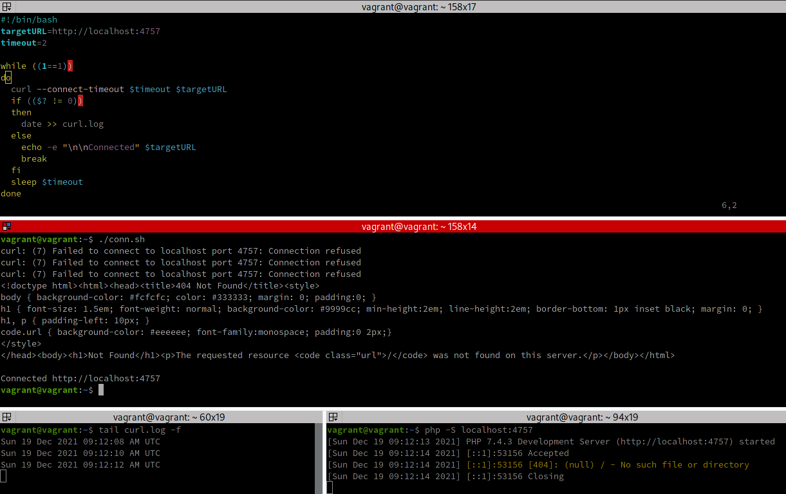
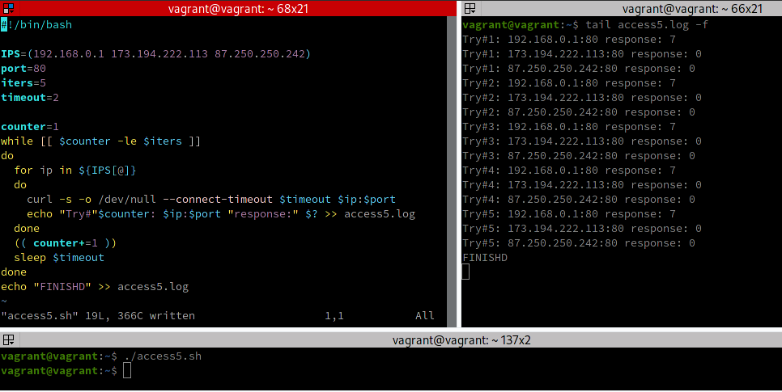
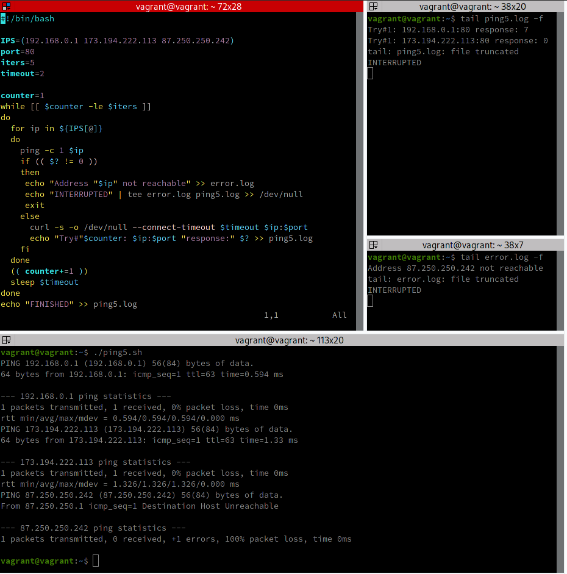

### Как сдавать задания

Привет! 

Вы уже изучили блок «Системы управления версиями», и начиная с этого занятия все ваши работы будут приниматься ссылками на .md-файлы.

---


# Домашнее задание к занятию "4.1. Командная оболочка Bash: Практические навыки"

## Обязательные задания

1. Есть скрипт:
	```bash
	a=1
	b=2
	c=a+b
	d=$a+$b
	e=$(($a+$b))
	```
    * Какие значения переменным c,d,e будут присвоены? Почему?


| Переменная | Значение | Обоснование                                                                                                                                                                                                                  |
|------------|---------|------------------------------------------------------------------------------------------------------------------------------------------------------------------------------------------------------------------------------|
| `c`        | a+b     | `a` и `b` здесь это не переменные (потому что не использовался оператор извлечения их значений (разыменования)), а просто ASCII-символы. В переменную `c` был размещен результат конкатенкации трех символов `a`, `+` и `b`. |
| `d`        | 1+2     | Переменные `a` и `b` были разыменованы, после чего произведена конкатенкация их значений и символа `+` между ними.                                                                                                           |
| `e`        | 3    | Переменные `a` и `b` были разыменованы, после чего произведено их суммирование и результат суммирования присвоен переменной `e`.                                                                                             |


---
2. На нашем локальном сервере упал сервис и мы написали скрипт, который постоянно проверяет его доступность, записывая дату проверок до тех пор, пока сервис не станет доступным. В скрипте допущена ошибка, из-за которой выполнение не может завершиться, при этом место на Жёстком Диске постоянно уменьшается. Что необходимо сделать, чтобы его исправить:
    ```bash
    while ((1==1)
    do
      curl https://localhost:4757
      if (($? != 0))
      then
        date >> curl.log
      fi
    done
    ```
   
Т.к. по условиям задачи дата проверки записывается ровно до тех пор, пока сервис не станет доступным, то после этого запись следует прекратить. Для этого цикл следует прервать, воспользовавшись командами `break` или `exit` в зависимости от потребности.

Т.о. работающий скрипт будет выглядеть следующим образом:

```bash
while ((1==1))
do
  curl https://localhost:4757
  if (($? != 0))
  then
    date >> curl.log
  else
    echo -e "\n\nConnected" $targetURL
    break
  fi
done

```

Когда требуемый URL станет доступным, то скрипт завершит работу, выдав сообщение "Connected".

**Проиллюстрируем примером.**

На следующем скриншоте приведен результат работы программы.

Код запущенного скрипта приведен в самом верхнем окне (скрипт слегка модифицирован для удобства).

В среднем окне отображен процесс исполнения скрипта. В нижнем левом окне отображается содержимое файла лога `curl.log`. В нижнем правом окне отображена команда запуска веб-сервера (для тестирования использовался встроенный в языковой пакет `PHP` тестовый веб-сервер, запускаемый командой `php -S localhost:4757`).



Как видим из скриншота, до запуска веб-сервера скрипт добавлял даты в файл лога. Но после того, как веб-сервер запустился, скрипт успешно установил с ним соединение и завершил свою работу сообщив:

````
Connected http://localhost:4757
````

---
3. Необходимо написать скрипт, который проверяет доступность трёх IP: 192.168.0.1, 173.194.222.113, 87.250.250.242 по 80 порту и записывает результат в файл log. Проверять доступность необходимо пять раз для каждого узла.

Простой скрипт будет иметь вид:

````bash
IPS=(192.168.0.1 173.194.222.113 87.250.250.242)

counter=1
while [[ $counter -le 5 ]]
do
  for ip in ${IPS[@]}
  do
    curl $ip:80
    echo "Try#"$counter: $ip:80 "response:" $? >> access5.log
  done
  (( counter+=1 ))
done
````

**Проиллюстрируем примером.**

У нас создано три сервера с указаными IP-адресами, при этом у `192.168.0.1` порт `80` недоступен, а у остальных IP-адресов `80` порт доступен.

На следующем скриншоте верхнее левое окно - это код скрипта (доработан для наглядности), правое окно - результат вывода в файл лога, а нижнее окно - команда запуска скрипта.



Как видим, после запуска скрипта каждый из указанных IP-адресов был проверен и после пяти циклов проверки работа было завершена.

---
4. Необходимо дописать скрипт из предыдущего задания так, чтобы он выполнялся до тех пор, пока один из узлов не окажется недоступным. Если любой из узлов недоступен - IP этого узла пишется в файл error, скрипт прерывается

Чтобы проверить доступность узла используем утилиту `ping` и перепишем скрипт таким образом, чтобы сначала однократно проверять доступность узла в целом и только потом проверять доступность порта:

````bash
IPS=(192.168.0.1 173.194.222.113 87.250.250.242)

counter=1
while [[ $counter -le 5 ]]
do
  for ip in ${IPS[@]}
  do
    ping -c 1 $ip
    if (( $? != 0 ))
    then
     echo "Address "$ip" not reachable" >> error.log
     exit
    else
      curl $ip:80
      echo "Try#"$counter: $ip:$port "response:" $? >> ping5.log
    fi
  done
  (( counter+=1 ))
done
````

**Проиллюстрируем примером.**

Как в предыдущем примере, у нас создано три сервера с указаными IP-адресами, при этом у `192.168.0.1` порт `80` недоступен, по адресу `173.194.222.113` доступен и узел и порт `80`, а узел `87.250.250.242` недоступен вообще.

На следующем скриншоте верхнее левое окно - это код скрипта (доработан для наглядности), правое верхнее окно - результат вывода в файл лога, правое нижнее окно - результат вывода в файл ошибок, а нижнее окно - команда запуска скрипта.



Как видим, после запуска скрипта выяснилось, что порт `80` по адресу `192.168.0.1` недоступен, порт `80` по адресу `173.194.222.113` доступен, а узел `87.250.250.242` недоступен вообще, после чего скрипт прекратил свою работу с выводом сообщение "INTERRUPTED".
